# Introduction

[toc]

## 1.0 Preface

### 1.0.1 History 

> The problem of searching for patterns in data is a fundamental one and has a long and
> successful history.

* Tycho Brahe in the 16th century allowed ohannes Kepler to discover the empirical laws of planetary motion.
* The discovery of regularities in atomic spectra played a key role in the development and verification of quantum physics in the early twentieth century.

==The field of pattern recognition is concerned with the automatic discovery of regularities in data through the use of computer algorithms and with the use of these regularities to take actions such as classifying the data into different categories.==

***

### 1.0.2 Recognize handwritten digits

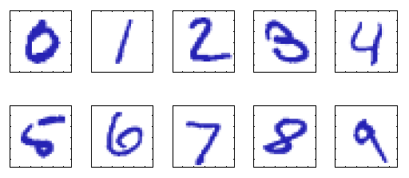

> Each digit corresponds to a 28×28 pixel image and so can be represented by a vector **x** comprising 784 real numbers

<u>**Goal**: build a machine that will take such a vector x as input and that will produce the identity of the digit 0, . . . , 9 as the output.</u>

Difficulty: It's tackled using handcrafted rules or heuristics for distinguishing the digits based on the shapes of the strokes.

**Better method:**

==Adopting a machine learning approach== 

We want:

* <u>a function y(x)</u> which takes a new digit image x as input and that generates an output vector y, encoded in the same way as the target vectors

We prepare: 

* a large set of N digits $\{x_1, . . . , x_N\} $called a <u>*training set*</u> is used to tune the parameters of an adaptive model, known in advance.
* express the category of a digit using *<u>target vector t</u>*, which represents the identity of the corresponding digit

We get:

* y(x) can then determine the identity of <u>new digit images</u>, which are said to comprise a <u>*test set*</u>
* ==The ability to categorize correctly new examples that differ from those used for training is known as *generalization*.==
* Generalization is a ==central goal== in pattern recognition, for the variability of the input vectors will be such that the training data can comprise only a tiny fraction of all possible input vectors.

In practice we do:

* the original input variables are typically *preprocessed* to transform them into some new space of variables where the pattern recognition problem will be easier to solve
* pre-processing stage is sometimes also called *feature extraction*. Note that new test data must be pre-processed using the same steps as the training data.
* the images  are typically translated and scaled into <u>a box of a fixed size</u>, reduce the variability
* pre-processing might also be performed in order to <u>speed up computation</u>
* care for information  *discarded*,  if this information is important to the solution of the problem then the overall accuracy of the system can suffer.

***

### 1.0.3 Domains of learning

1. #### ***supervised learning**:* training data comprises examples of the input vectors along with their corresponding target vectors. 
   
   * If the desired output consists of one or more continuous variables, then the task is called ***regression***.
2. #### ***unsupervised learning***: training data consists of a set of input vectors x without any corresponding target values. 
   
   * Discovering groups of similar examples within the data is called ***clustering***. 
   * Determining the distribution of data within the input space is known as ***density estimation***.
   * Project the data from a high-dimensional space down to two or three dimensions for the purpose of ***visualization***.
3. #### ***reinforcement learning***: finding suitable actions to take in a given situation in order to maximize a reward. Learning algorithm is not given examples of optimal outputs, but must instead discover them by a process of trial and error.
   
   * A general feature of reinforcement learning is the trade-off between *exploration*, in which the system tries out new kinds of actions to see how effective they are, and *exploitation*, in which the system makes use of actions that are known to yield a high reward. Too strong a focus on either exploration or exploitation will yield poor results.

***

## 1.1 Example: Polynomial Curve Fitting

### **Problem Intro**:

* Suppose we <u>observe</u> a *real-valued input variable x* and we wish to use this observation to <u>predict</u> the value of a *real-valued target variable t*.
* The data for this example is generated from the function $sin(2πx)$ with random noise included in the target values.

**What we have:**

A training set comprising N observations of x, written$ x ≡ (x_1, . . . , x_N)^T$, together with corresponding observations of the values of t, denoted $t ≡ (t_1, . . . , t_N)^T$, as shown below. The green curve shows the function $sin(2πx)$ used to generate
the data. Our goal is to predict the value of t for some new value of x, without knowledge of the green curve.

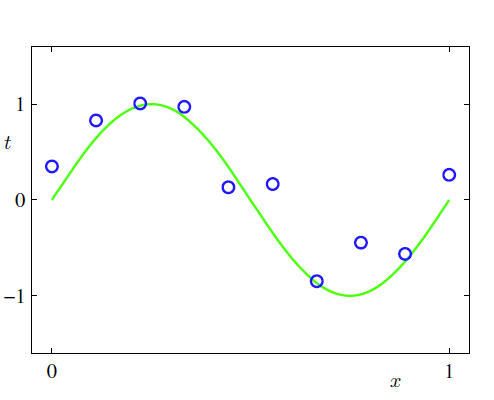

> Why we add a noise?
>
> This noise might arise from ==intrinsically stochastic== (i.e. random) processes
> such as <u>radioactive decay</u> but more typically is due to <u>there being sources of variability that are themselves unobserved</u>.

**Our goal**:

exploit this training set in order to make predictions of the value $\hat{t}$ of the target variable for some new value $\hat{x}$ of the input variable.

**What we need**:

* *Probability theory* provides a framework for expressing such uncertainty in a precise and quantitative manner.
* *Decision theory* allows us to exploit this probabilistic representation in order to make predictions that are optimal according to appropriate criteria.

***

**We consider a simple approach**:

In particular, we shall fit the data using <u>a polynomial function of the form</u>:
$$
y(x,\textbf{w})=w_0+w_1x+w_2x^2+_\cdots+w_Mx^M=\sum_{j=0}^{M}w_jx^j\tag{1.1}
$$

* $\textit{M}$ is the *order* of the polynomial
* $x^j$ denotes $x$ raised to the power of $j$
* $w_0, _\cdots, w_M$  are collectively denoted by the vector $\textbf{w}$
* Our function is nonlinear to $x$, <u>but linear to  $\textbf{w}$</u>, so it's called *linear model*.

### **How we determine the coefficient $\textbf{w}$: minimize the error function**

By minimizing an *error function* that measures the misfit between the function $y(x,\textbf{w})$.

One simple choice of error function, which is widely used, is given by the sum of the squares of the errors between the predictions $y(x_n,\textbf{w})$ for each data point $x_n$ and the corresponding target values $t_n$, so that we minimize
$$
E(\textbf{w})=\frac{1}{2}\sum_{n=1}^{N}\{y(x_n,\textbf{w})-t_n\}^2\tag{1.2}
$$

> the factor 1/2 isincluded for later convenience

it is a nonnegative quantity that would be zero if, and only if, the function $y(x_n,\textbf{w})$ were to pass exactly through each training data point. As shown of the green bars below.

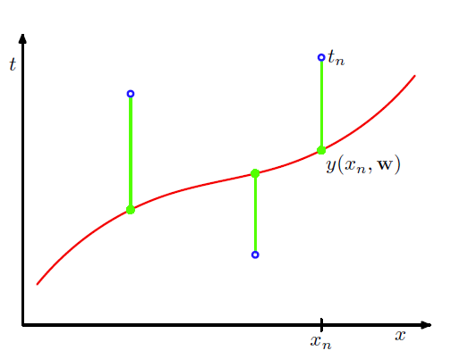

* Since: the error function is <u>a quadratic function</u> of the coefficients $\textbf{w}$
* we can infer: its ==derivatives== with respect to the coefficients will be <u>linear</u> in the elements of $\textbf{w}$
* so we can get so the minimization of the error function has a unique solution,
  denoted by $\textbf{w}^\star$, which can be found in closed form.

***

### **How we choose the order $\textit{M}$ : Avoid overfitting**

This is an important concept called *model comparison* or *model selection*

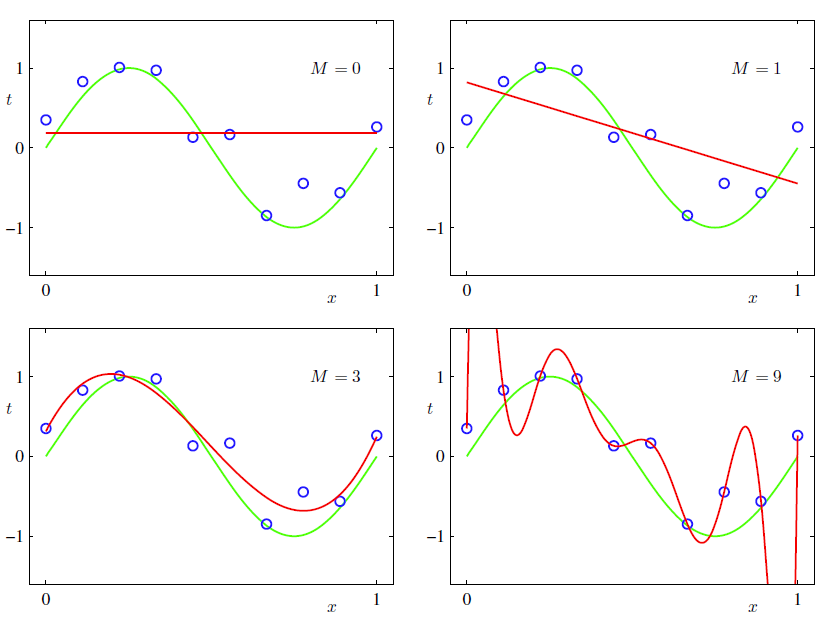

* $\textit{M}=0\ and \ 1$​ polynomials give rather poor fits to the data and consequently rather poor representations of the function $sin(2πx)$.
* $\textit{M}=3$​ polynomial seems to give the best fit to the function $sin(2πx)$ of the examples.
* $\textit{M}=9$ excellent fit. $E(\textbf{w}^\star)=0$​.However, the fitted curve oscillates wildly and gives a very poor representation of the function $sin(2πx)$. This latter behaviour is known as *over-fitting*.

**How we evaluate**:

Considering a separate test set comprising <u>100 data points</u> generated <u>using exactly the same procedure used to generate the training set points</u> but with <u>new choices for the random noise values</u> included in the target values.

We use root-mean-square (RMS) error defined by
$$
E_{RMS}=\sqrt{2E(\textbf{w}^\star)/N}\tag{1.3}
$$

* $\textit{N}$​ allows us to compare different sizes of data sets on an equal footing
* the square root ensures that $E_{RMS}$​ is measured on the same scale (and in the same units) as the target variable $t$.

Graphs of the root-mean-square error:

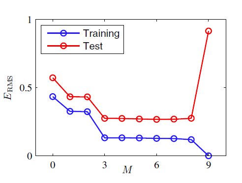

> We only have 10 data points in the training set so when $\textit{M}=9$ it tuned exactly to them.

**We gain some insight**:

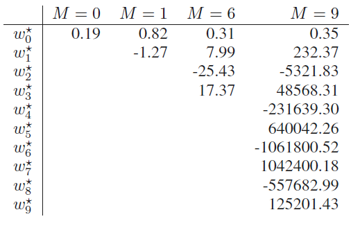

$\textit{M}=9$ the coefficients have become finely tuned to the data <u>by developing large positive and negative values</u> so that the corresponding polynomial function matches each of the data points exactly, but between data points (particularly near the ends of the range) the function exhibits the large oscillations observed

**How model behaves as the size of the dataset is varied**:

For a given model complexity, ==the over-fitting problem become less severe as the size of the data set increases.==

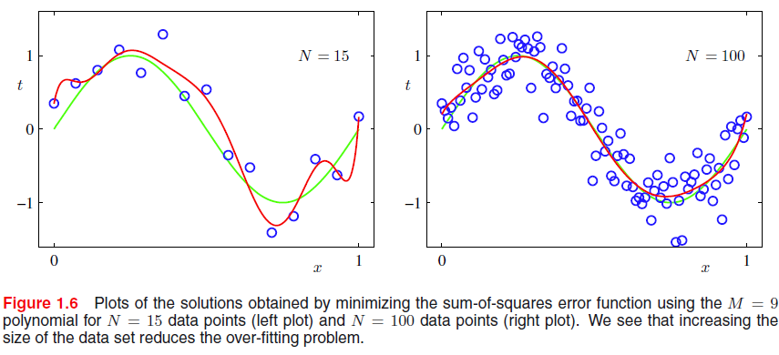

==Another way to say this is that the larger the data set, the more complex (in other words more flexible) the model that we can afford to fit to the data.==

>One rough heuristic that is sometimes advocated is that <u>the number of data points should be no less than some multiple (say 5 or 10) of the number of adaptive parameters</u> in the model.

***

### **How we limit the complexity and flexibility of the model: Regularization**

> One technique that is often used to control the over-fitting phenomenon in such cases is that of *regularization*.

Adding a <u>penalty term</u> to the error function in order to discourage the coefficients from reaching large values, leading to a modified error function of the form
$$
\tilde{E}(\textbf{w})=\frac{1}{2}\sum_{n=1}^{N}\{y(x_n,\textbf{w})-t_n\}^2+\frac{\lambda}{2}||\textbf{w}||^2\tag{1.4}
$$

* $||\textbf{w}||^2\equiv \textbf{w}^T\textbf{w}=w_0^2+w_1^2+_\cdots+w_M^2$
* the coefficient $\lambda$​ governs the <u>relative importance of the regularization term compared with the sum-of-squares error term</u>

In particular, this quadratic regularizer is called *ridge regression* (Hoerl and Kennard, 1970). In the context of neural networks, this approach is known as *weight decay*.

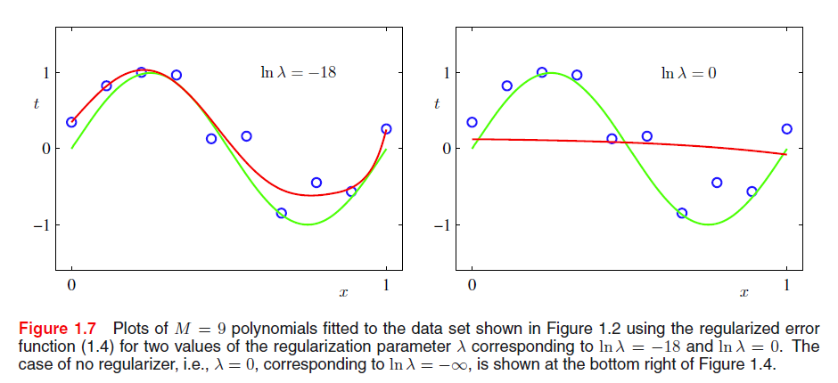

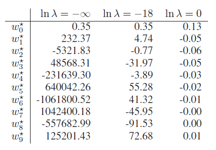

==The graph and the table show that regularization has the desired effect of reducing the magnitude of the coefficients.==

The impact of the regularization term on the generalization error can be seen by
plotting the value of the RMS error for both training and test sets against $ln λ$

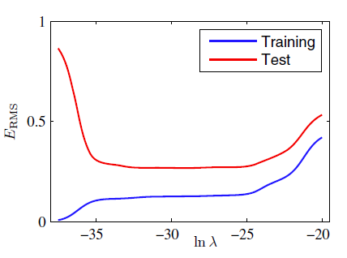

>We see that in effect $λ$ now controls the effective complexity of the model and hence determines the degree of over-fitting.

***

## 1.2 Probability Theory

==A key concept in the field of pattern recognition is that of uncertainty.==

**The Rules of Probability**
$$
\begin{align}
	\textbf{sum\ rule}\ \ p(X)&=\sum_Yp(X,Y)\tag{1.10}\\
	\textbf{product rule}\ \ p(X,Y)&=p(Y|X)p(X)\tag{1.11}
\end{align}
$$
*Bayes' theorem*:
$$
p(Y|X)=\frac{p(X|Y)p(Y)}{p(X)}\tag{1.12}
$$
Using the sum rule, the denominator in Bayes’ theorem can be expressed in terms of the quantities appearing in the numerator
$$
p(X)=\sum_{Y}p(X|Y)p(Y)\tag{1.13}
$$
Finally, we note that if the joint distribution of two variables factorizes into the product of the marginals, so that
$$
p(X,Y)=p(X)p(Y)\tag{1.14}
$$
then $X$ and $Y$ are said to be *independent*.

***

### 1.2.1 Probability densities

The probability that $x$ will lie in an interval $(a,b)$ is then given by
$$
p(x\in (a,b))=\int_{a}^{b}p(x)\textrm{d}x\tag{1.24}
$$
Because probabilities are nonnegative, and because the value of $x$ must lie somewhere on the real axis, the probability density $p(x)$ must satisfy the two conditions
$$
\begin{align}
	p(x)&\ge0\tag{1.25}\\
	\int_{-\infty}^\infty p(x)dx&=1\tag{1.26}
\end{align}
$$
If we consider a change of variables $x=g(y)$, the a function $f(x)$ becomes $\tilde{f}(y)=f(g(y))$. Note that $p_x(x)\delta x\simeq p_y(y)\delta y$. Then we have the transform below
$$
\begin{align}
	p_y(y)&=p_x(x)|\frac{dx}{dy}|\\
	&=p_x(g(y))|g^\prime(y)|\tag{1.27}
\end{align}
$$
The probability that $x$ lies in the interval $(-\infty,z)$ is given by the *cumulative distribution function* defined by
$$
P(x)=\int_{-\infty}^{z}p(x)dx\tag{1.28}
$$
which satisfies $P^\prime (x)=p(x)$

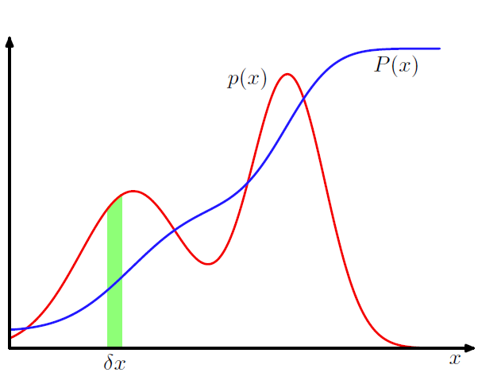

If we have several continues variables $x_1,_\cdots,x_D$, denoted collectively by the vector $\textbf{x}$, then we can define a joint probability density $p(\textbf{x})=p(x_1,_\cdots,x_D)$ such that the probability of $\textbf{x}$ falling in an interval volume $\delta\textbf{x}$ containing the point $\textbf{x}$ is given by $p(\textbf{x})\delta\textbf{x}$. This multivariate probability density must satisfy
$$
\begin{align}
	p(\textbf{x})&\ge 0\tag{1.29}\\
	\int p(\textbf{x})&=1\tag{1.29}
\end{align}
$$
in which the integral is taken over the whole of $\textbf{x}$ space. We can also consider joint probability distributions over a combination of discrete and continuous variables.

The sum and product rules of probability, as well as Bayes’ theorem, apply equally to the case of probability densities, or to combinations of discrete and continuous
variables.
$$
\begin{align}
	p(x)&=\int p(x,y)dy\tag{1.31}\\
	p(x,y)&=p(y|x)p(x)\tag{1.32}
\end{align}
$$

***

### 1.2.2 Expectations and covariances

One of the most important operations involving probabilities is that of finding <u>weighted averages of functions</u>.

a discrete distribution, it is given by
$$
\mathbb{E}[f]=\sum_x p(x)f(x)\tag{1.33}
$$
so that the average is weighted by the relative probabilities of the different values of $x$.

In the case of continuous variables, expectations are expressed in terms of an integration with respect to the corresponding probability density
$$
\mathbb{E}[f]=\int p(x)f(x)dx\tag{1.34}
$$
In either case, if we are given a finite number$N$ of points drawn from the probability distribution or probability density, then the expectation can be approximated as a finite sum over these points
$$
\mathbb{E}[f]\simeq \frac{1}{N}\sum_{n=1}^{N}f(x_n)\tag{1.35}
$$
The approximation becomes exact in the limit $N\rightarrow \infty$.

Sometimes we will be considering expectations of functions of several variables, in which case we can <u>use a subscript to indicate which variable is being averaged over</u>, so that for instance
$$
\mathbb{E}_x[f|y]\tag{1.36}
$$
denotes the average of the function $f(x,y)$ with respect to the distribution of $x$. Note that $\mathbb{E}_x[f(x,y)]$ will be a function of $y$.

We can also consider a *conditional expectation* with respect to a conditional distribution, so that
$$
\mathbb{E}_x[f|y]=\sum_xp(x|y)f(x)\tag{1.37}
$$
with an analogous definition for continuous variables.

The *variance* of $f(x)$ is defined by
$$
\textrm{var}[f]=\mathbb{E}[(f(x)-\mathbb{E}[f(x)])^2]\tag{1.38}
$$
and provides a measure of how much variability there is in $f(x)$ around its mean value $\mathbb{E}[f(x)]$.

Expanding out the square, we see that the variance can also be written in terms of the expectations of $f(x)$ and $f(x)^2$
$$
\textrm{var}[f]=\mathbb{E}[f(x)^2]-\mathbb{E}[f(x)]^2\tag{1.39}
$$
For two random variables $x$ and $y$, the *covariance* is defined by
$$
\begin{align}
\textrm{cov}[x,y]&=\mathbb{E}_{x,y}\big[\{x-\mathbb{E}[x]\}\{y-\mathbb{E}[y]\}\big]
\\
&=\mathbb{E}_{x,y}[xy]-\mathbb{E}[x]\mathbb{E}[y]\tag{1.41}
\end{align}
$$
If x and y are independent, then their covariance vanishes.

In the case of two vectors of random variables $\textbf{x}$ and $\textbf{y}$, the covariance is a matrix
$$
\begin{align}
	\textrm{cov}[\textbf{x},\textbf{y}]&=\mathbb{E}_{\textbf{x},\textbf{y}}\big[\{\textbf{x}-\mathbb{E}[\textbf{x}]\}\{\textbf{y}^T-\mathbb{E}[\textbf{y}^T]\}\big]\\
	&=\mathbb{E}_{\textbf{x},\textbf{y}}[{\textbf{x}\textbf{y}^T}]-\mathbb{E}[\textbf{x}]\mathbb{E}[\textbf{y}^T]\tag{1.42}
\end{align}
$$

***

### 1.2.3 Bayesian probabilities

> Now we turn to the more general *Bayesian* view, in which probabilities provide a quantification of uncertainty.

Some events that <u>cannot be repeated numerous times</u> in order to define a notion of probability . We would like to be able to quantify our expression of uncertainty and make precise revisions of uncertainty in the light of new evidence, as well as subsequently to be able to take optimal actions or decisions as a consequence.

>Cox (1946) showed that if numerical values are used to represent degrees of belief, then a simple set of axioms encoding common sense properties of such beliefs leads uniquely to a set of rules for manipulating degrees of belief that are equivalent to the sum and product rules of probability. This provided the first rigorous proof that probability theory could be regarded as an extension of Boolean logic to situations involving uncertainty (Jaynes, 2003).

In my word: probability theory can be regarded as an extention of Boolean logic in uncertainty situation.

Now, let us use the machinery of probability theory to describe the uncertainty in model parameters such as $\textbf{w}$ from a Bayesian perspective.

We capture our assumptions about $\textbf{w}$, before observing the data, in the form of a prior probability distribution $p(\textbf{w})$. The effect of the observed data $\mathcal{D} = \{t_1, . . . , t_N\} $ is expressed through the conditional probability $p(D|\textbf{w})$

Bayes' theorem, which takes the form
$$
p(\textbf{w}|\mathcal{D})=\frac{p(\mathcal{D}|\textbf{w})p(\textbf{w})}{p(D)}\tag{1.43}
$$
then allows us to evaluate the uncertainty in $\textbf{w}$ after we have observed $\mathcal{D}$ in the form of the posterior probability $p(\textbf{w}|\mathcal{D})$.

The quantity $p(D|\textbf{w})$ on the right-hand side of Bayes’ theorem is evaluated for the observed data set $\mathcal{D}$ and can be viewed as a function of the parameter vector $\textbf{w}$, in which case it is called the *likelihood function*. It expresses how probable the observed data set is, for different settings of the parameter vector $\textbf{w}$.

Given this definition of likelihood, we can state Bayes’ theorem in words
$$
\textrm{posterior} \propto \textrm{likelihood} \times \textrm{prior}\tag{1.44}
$$
where all of these quantities are viewed as functions of $\textbf{w}$.

* In a frequentist setting, $\textbf{w}$ is considered to be a <u>fixed parameter</u>, whose value is determined by some form of ‘estimator’, and error bars on this estimate are obtained by considering the distribution of possible data sets $\mathcal{D}$.
  * One approach to determining frequentist error bars is the *bootstrap*. Briefly, our original data set consists of $N$ data points $X=\{x_1,_\cdots,x_N\}$. We can create a new dataset $X_B$ by drawing $N$ points at random from $X$. This process can be repeated $L$ times to generate $L$ data sets each of size $N$ and each obtained by sampling from the original data set $X$​.The statistical accuracy of parameter estimates can then be evaluated by looking at the variability of predictions between the different bootstrap data sets.
* By contrast, from the Bayesian viewpoint there is only a single data set $\mathcal{D}$ (namely the one that is actually observed), and the <u>uncertainty in the parameters is expressed through a probability distribution over $\textbf{w}$</u>.
  * One advantage of the Bayesian viewpoint is that the inclusion of prior knowledge arises naturally.

### 1.2.4 The Gaussian distribution

One of the most important probability distributions for continues variables: *normal* or *Gaussian* distribution.

For the case of a single real-valued variable $x$, the Gaussian distribution is defined
by
$$
\mathcal{N}(x|\mu,\sigma^2)=\frac{1}{(2\pi\sigma^2)^{\frac{1}{2}}}\exp{\left\{-\frac{1}{2\sigma^2}(x-\mu)^2\right\}}\tag{1.46}
$$

* $\mu$ is called the *mean*
* $\sigma^2$ is called the *variance*
* $\sigma$ is called the *standard deviation*
* $\beta=1/\sigma^2$ is called the *precision*

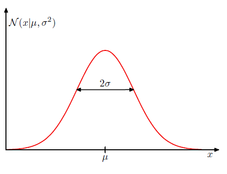

We can see that the Gaussian distribution satisfied:
$$
\mathcal{N}(x|\mu,\sigma^2)>0\tag{1.47}
$$
also:
$$
\int_{-\infty}^{\infty}\mathcal{N}(x|\mu,\sigma^2)\textrm{d}x=1\tag{1.48}
$$
Thus the PDF satisfies the two requirements for a valid probability density.

We can readily find expectations of functions of x under the Gaussian distribution. In particular, the average value of $x$ is given by
$$
\mathbb{E}[x]=\int_{-\infty}^{\infty}\mathcal{N}(x|\mu,\sigma^2)x\textrm{d}x=\mu\tag{1.49}
$$
Similarly, for the second order moment
$$
\mathbb{E}[x^2]=\int_{-\infty}^{\infty}\mathcal{N}(x|\mu,\sigma^2)x^2\textrm{d}x=\mu^2+\sigma^2\tag{1.50}
$$
The variance of $x$ is given by
$$
\textrm{var}[x]=\mathbb{E}[x^2]-\mathbb{E}[x]^2=\sigma^2\tag{1.51}
$$
The maximum of a distribution is known as its **mode**. For a Gaussian, the mode coincides with the mean, for it is the highest point of the curve and have the most probability.

The Gaussian distribution defined over a $\mathcal{D}$-dimensional vector $\textbf{x}$ of continuous variables is given by
$$
\mathcal{N}(\textbf{x}|\mu,\Sigma)=\frac{1}{(2\pi)^{D/2}}\frac{1}{|\Sigma|^{1/2}}\exp{\left\{-\frac{1}{2}(\textbf{x}-\mu)^\textup{T}\Sigma^{-1}(\textbf{x}-\mu)\right\}}\tag{1.52}
$$

* The $D$-dimensional vector $\mu$ is  called the mean
* The $D\times D$ matrix $\Sigma$ is called the covariance
* The $|\Sigma|$ denotes the determinant of $\Sigma$.

***

Now suppose that we have a dataset of observations $\textbf{x}=(x_1,_\cdots,x_N)^T$,representing $N$ observations of scalar variable $x$. And our dataset  $\textbf{x}$ is i.i.d., we can write the probability of the dataset, given $\mu$ and $\sigma^2$, in the form
$$
p(\textbf{x}|\mu,\sigma^2)=\prod_{n=1}^{N}\mathcal{N}(x_n|\mu,\sigma^2)\tag{1.53}
$$
When viewed as a function of $\mu$ and $\sigma^2$, this is the likelihood function for theGaussian and is interpreted diagrammatically in the Figure below

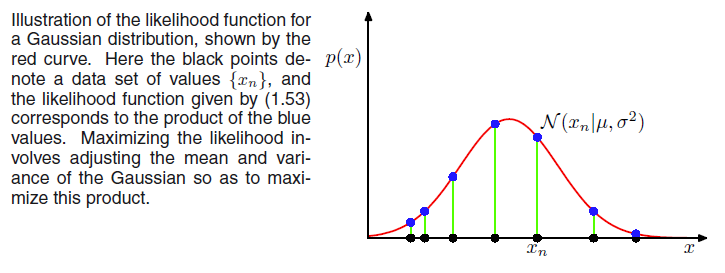

The log likelihood function can be written in the form
$$
\ln{p}(\textbf{x}|\mu,\sigma^2)=-\frac{1}{2\sigma^2}\sum_{n=1}^{N}(x_n-\mu)^2-\frac{N}{2}\ln\sigma^2-\frac{N}{2}\ln(2\pi)\tag{1.54}
$$
Maximizing with respect to $\mu$, we obtain the maximum likelihood solution given by
$$
\mu_{ML}=\frac{1}{N}\sum_{n=1}^{N}x_n\tag{1.55}
$$
which is the *sample mean*, i.e., the mean of the observed values $\{x_n\}$.

Similarly, maximizing with respect to $\sigma^2$, we obtain the maximum likelihood solution for the variance in the form
$$
\sigma_{ML}^2=\frac{1}{N}\sum_{n=1}^{N}(x_n-\mu_{ML})^2\tag{1.56}
$$
which is the *sample variance* measured with respect to the sample mean $\mu_{ML}$.

An example of a phenomenon called *bias* and is related to the problem of over-fitting encountered in the text of polynomial curve fitting. We first note that the maximum likelihood solutions $μ_{ML}$ and $σ^2_{ML}$ are functions of the data set values $x_1, . . . , x_N$. Consider the expectations of these quantities with respect to the data set values, which themselves come from a Gaussian distribution with parameters $μ$ and $σ_2$. It is straightforward to show that
$$
\begin{align}
	\mathbb{E}[\mu_{ML}] &=\mu\tag{1.57}\\
	\mathbb{E}[σ^2_{ML}] &=\left(\frac{N-1}{N}\right)\sigma^2\tag{1.58}
\end{align}
$$
so that on average the maximum likelihood estimate will obtain the correct mean but will underestimate the true variance by a factor $(N-1)/N$. The intuition behind this result is given by Figure below

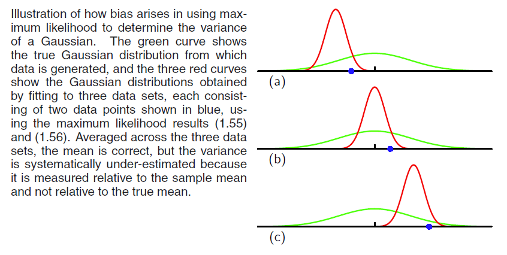

The varience parameter unbiased:
$$
\tilde{\sigma}^2=\frac{N}{N-1}\sigma_{ML}^2=\frac{1}{N-1}\sum_{n=1}^{N}(x_n-\mu_{ML})^2\tag{1.59}
$$
Note that the bias of the maximum likelihood solution becomes less significant as the number N of data points increases, and in the limit $N → ∞$the maximum likelihood solution for the variance equals the true variance of the distribution that generated the data.

***

### 1.2.5 Curving fitting re-visited

Here we return to the curve fitting example and view it from a probabilistic perspective, thereby gaining some insights into error functions and regularization, as well as taking us towards a full Bayesian treatment.

**Our goal:**

* The goal in the curve fitting problem is to be able to make predictions for the target variable $t$ given some new value of the input variable $x$ on the basis of a set of training data comprising $N$ input values $x = (x_1, . . . , x_N)^T$ and their corresponding target values $t = (t_1, . . . , t_N)^T$.

**We make an assumption:**

Given the value of $x$, the corresponding value of $t$ has a Gaussian distribution with a mean equal to the value $y(x,\textbf{w})$ of the polynomial curve. Thus we have
$$
p(t|x,\textbf{w},\beta)=\mathcal{N}(t|y(x,\textbf{w}),\beta^{-1})\tag{1.60}
$$

* We have defined a precision parameter $\beta$ corresponding to the inverse varience of the distribution.

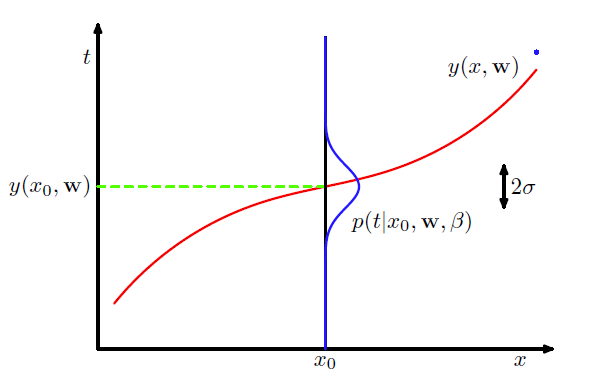

We now use the training data $\{\textbf{x,t}\}$ to determine the values of the unknown parameters $\textbf{w}$ and $\beta$ by maximum likelihood. If the data are assumed to be drawn independently from the distribution just above, then the likelihood functions is given by
$$
p(\textbf{t}|\textbf{x},\textbf{w},\beta)=\prod_{n=1}^{N}\mathcal{N}(t_n|y(x_n,\textbf{w}),\beta^{-1})\tag{1.61}
$$
As we did before, it is convenient to maximize the logarithm of the likelihood function. We obtain the log likelihood function in the form
$$
\ln{p(\textbf{t}|\textbf{x},\textbf{w},\beta)}=-\frac{\beta}{2}\sum_{n=1}^{N}\{y(x_n,\textbf{w})-t_n\}^2+\frac{N}{2}\ln{\beta}-\frac{N}{2}\ln{(2\pi)}\tag{1.62}
$$
**Initially:**

1. We consider the $\textbf{w}_{ML}$. Since the last two terms on the right-hand side do not depend on $\textbf{w}$,  we omit them. 
2. Also, scaling factor does not effects the maximum procedure, so we replace the coefficient $\beta/2$ with $1/2$.
3. Finally, we transfer the maximizing on log into minimizing the negative log, which leads to minimizing the *sum-of-squares-error*. Thus the sum-of-squares error function has arisen as a consequence of maximizing likelihood under the assumption of a Gaussian noise distribution.

We can also use maximum likelihood to determine the precision parameter $\beta$ of the Gaussian conditional distribution. Maximizing with respect to $\beta$ gives
$$
\frac{1}{\beta_{ML}}=\frac{1}{N}\sum_{n=1}^{N}\{y(x_n,\textbf{w})-t_n\}^2\tag{1.63}
$$
Having determined the parameters $\textbf{w}$ and $β$, we can now make predictions for new values of $x$. Because we now have a probabilistic model, these are expressed in terms of the predictive distribution that gives the probability distribution over t, rather than simply a point estimate, and is obtained by substituting the maximum likelihood parameters to give
$$
p(t|x,\textbf{w}_{ML},\beta_{ML})=\mathcal{N}(t|y(x,\textbf{w}_{ML}),\beta_{ML}^{-1})\tag{1.64}
$$
Now let us take a step towards a more Bayesian approach and introduce a prior distribution over the polynomial coefficients $\textbf{w}$. For simplicity, let us consider a Gaussian distribution of the form
$$
p(\textbf{w}|\alpha)=\mathcal{N}(\textbf{w}|\textbf{0},\alpha^{-1}\textbf{I})=(\frac{\alpha}{2\pi})^{(M+1)/2}\exp{\left\{-\frac{\alpha}{2}\textbf{w}^\textup{T}\textbf{w}\right\}}\tag{1.65}
$$

* $\alpha$ is the precision of the distribution.
* $M+1$ is the total number of the elements in the vector $\textbf{w}$ for an $M^{th}$ order polynomial.
* Variables such as $\alpha$, which control the distribution of the model parameters, are called *hyperparameters*.

Using Bayes' theorem, the posterior distribution for $\textbf{w}$ is proportional to the product of the prior distribution and the likelihood function
$$
p(\textup{w}|\textbf{x,t},\alpha,\beta)\propto p(\textbf{t|x},\textup{w},\beta)p(\textup{w}|\alpha)\tag{1.66}
$$
we can now determine the $\textup{w}$ by finding the most probable value of $\textup{w}$ given the data, in other words by maximizing the posterior distribution. This technique is called *maximum posterior*, or simply *MAP*. Taking the negative logarithm of the posterior and combine with the expression of prior and likelihood, we find that the maximum of the posterior is given by the minimum of
$$
\frac{\beta}{2}\sum_{n=1}^{N}\{y(x_n,\textbf{w})-t_n\}^2+\frac{\alpha}{2}\textbf{w}^\textup{T}\textbf{w}\tag{1.67}
$$

Thus we see that maximizing the posterior distribution is equivalent to minimizing the regularized sum-of-squares error function encountered earlier in the form of polynomial episode, with a regularization parameter given by $\lambda=\alpha/\beta$.

***

### 1.2.6 Bayesian curve fitting

Although we have included a prior distribution $p(\textbf{w}|\alpha)$, we are still making a point estimate of $\textbf{w}$ and so this does not yet amount to Bayesian treatment.

In a fully Bayesian approach, we should apply:

* sum rule of probability
* product rule of probability

**Our goal:**

To predict the value of $t$, given the training data $\textrm{x}$ and $\textrm{t}$ along with a new test point $x$.

Therefore, we wish to evaluate the predictive distribution $p(t|x,\textbf{x},\textbf{t})$.

**Assumption:**

The parameters $\alpha$ and $\beta$ are fixed and known in advance.

**Now we start:**

A Bayesian treatment simply corresponds to a consistent application of the sum and product rules of probability, which allow the predictive distribution to be written in the form  
$$
p(t|x,\textbf{x},\textbf{t})=\int{p(t|x,\textbf{w})p(\textbf{w}|\textbf{x,t})\textrm{d}\textbf{w}}\tag{1.68}
$$

* $p(t|x,\textbf{w})$ is given by (1.60).
* we have omitted the dependence on $\alpha$ and $\beta$.
* $p(\textbf{w}|\textbf{x,t})$ is the posterior distribution over parameters, and can be found by normalizing the right-hand side of (1.66).

Similarly, the integration in (1.68) can also be performed analytically with the result that the predictive distribution is given by a Gaussian of the form  
$$
p(t|x,\textbf{x},\textbf{t})=\mathcal{N}(t|m(x),s^2(x))\tag{1.69}
$$
where the mean and variance are given by
$$
\begin{align}
    m(x)&=\beta\phi(x)^\textrm{T}\textbf{S}\sum_{n=1}^{N}\phi(x_n)t_n \tag{1.70}
\\
    s^2(x)&=\beta^{-1}+\phi(x)^{\textrm{T}}\textbf{S}\phi(x) \tag{1.71}
\end{align}
$$

Here the matrix $\textbf{S}$ is given by
$$
\textbf{S}^{-1}=\alpha\textbf{I}+\beta\sum_{n=1}^{N}\phi(x_n)\phi(x_n)^{\textrm{T}}\tag{1.72}
$$

* $\textbf{I}$ is the unit matrix
* vector $\phi(x)$ is defined with elements $\phi_i(x)=x^i$ for $i=0,_\cdots,M$

**What we can see:**

* We see that the variance, as well as the mean, of the predictive distribution in (1.69) is dependent on $x$.  
* The first term in (1.71) represents the uncertainty in the predicted value of $t$ due to the noise on the target variables and was expressed already in the maximum likelihood predictive distribution (1.64) through $β_{ML}^{-1}$ .   
* However, the second term arises from the uncertainty in the parameters $\textbf{w}$ and is a consequence of the Bayesian treatment.  

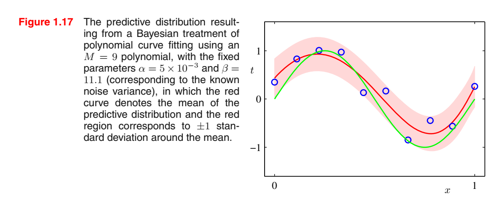

## 1.3 Model Selection

In our example of polynomial curve fitting using least squares, we saw that there was an optimal order of polynomial that gave the best generalization. The order of the polynomial controls the number of free parameters in the model and thereby governs the model complexity. We have already seen that, in the maximum likelihood approach, the performance on the training set is not a good indicator of predictive performance on unseen data due to the problem of over-fitting.  

#### **K-fold cross validation:**

In many applications, however, the supply of data for training and testing will be limited, and in order to build good models, we wish to use as much of the available data as possible for training.  

However, if the validation set is small, it will give a relatively noisy estimate of predictive performance. One solution to this dilemma is to use *cross-validation*.:

* This allows a proportion $(S - 1)/S$ of the available data to be used for training while making use of all of the data to assess performance. 
* When data is particularly scarce, it may be appropriate to consider the case $S = N$, where $N$ is the total number of data points, which gives the *leave-one-out* technique.  

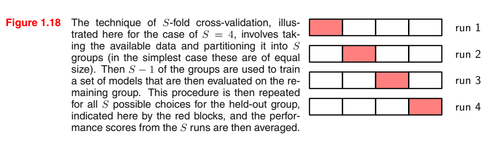

* Drawback: 
  * cross-validation is that the number of training runs that must be performed is increased by a factor of $S$
  * we might have multiple complexity parameters for a single model

* Historical information criteria :
  * *Akaike information criterion*, or AIC
    $$
    \ln{p}(\mathcal{D}|\textbf{w}_{ML})-M
    $$
    the first term is the best-fit log likelihood, and $M$ is the number of adjustable parameters in the model.   
  
  * *Bayesian information criterion*, or BIC

***

## 1.4 The Curse of Dimensionality

**Problem case:**

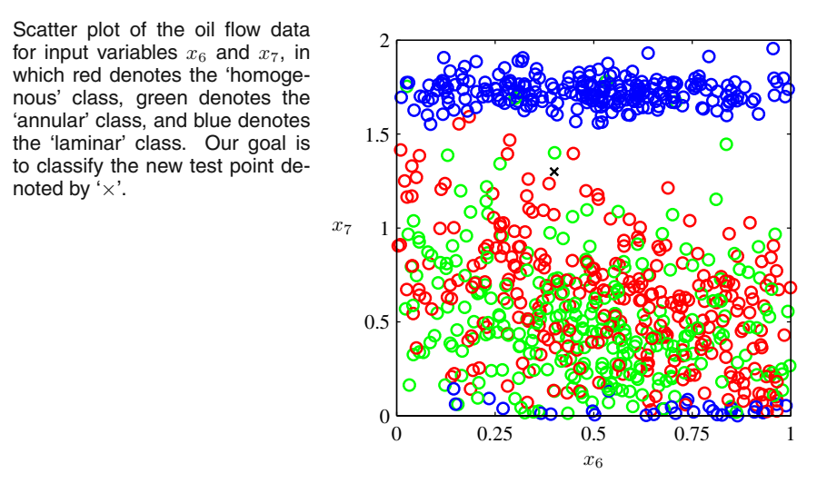

> a mixture of oil, water, and gas (Bishop and James, 1993). These three materials can be present in one of three different geometrical configurations known as ‘homogeneous’, ‘annular’, and ‘laminar’, and the fractions of the three materials can also vary. Each data point comprises a 12-dimensional input vector consisting of measurements taken with gamma ray densitometers that measure the attenuation of gamma rays passing along narrow beams through the pipe.   

How can we turn this intuition into a learning algorithm? One very simple approach would be to divide the input space into regular cells.

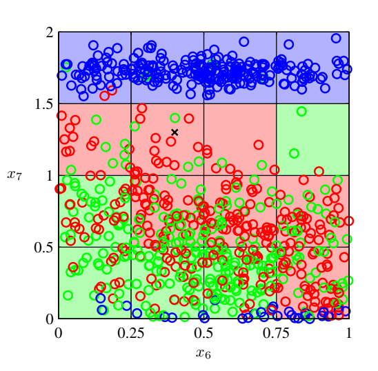

There are numerous problems with this naive approach, but one of the most severe becomes apparent when we consider its extension to problems having larger numbers of input variables, corresponding to input spaces of higher dimensionality.  

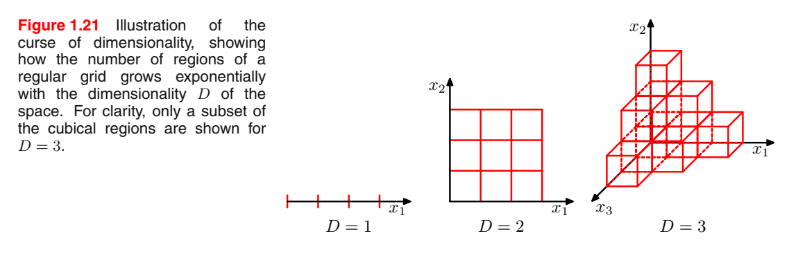

>  if we divide a region of a space into regular cells, then the number of such cells grows exponentially with the dimensionality of the space.  

**From the polynomial curve fitting and considering how we would  extend this approach to deal with input spaces having several variables.  **

If we have D input variables, then a general polynomial with coefficients up to order 3 would take the form  
$$
y(\textbf{x},\textbf{w})=w_0+\sum_{i=1}^{D}w_ix_i+\sum_{i=1}^{D}\sum_{j=1}^{D}w_{ij}x_ix_j+\sum_{i=1}^{D}\sum_{j=1}^{D}\sum_{k=1}^{D}w_{ijk}x_ix_jx_k\tag{1.74}
$$
As $D$ increases, so the number of independent coefficients (not all of the coefficients are independent due to interchange symmetries amongst the x variables) grows proportionally to $D^3$.   

**A primer idea:**

* We see that, for large $D$, this fraction tends to 1 even for small values of . Thus, in spaces of high dimensionality, most of the volume of a sphere is concentrated in a thin shell near the surface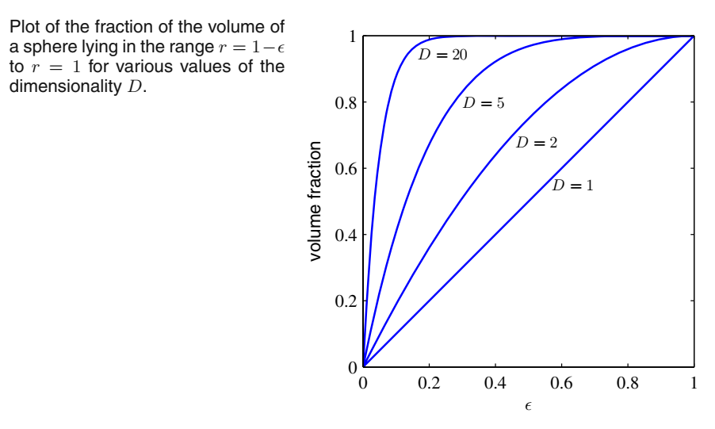
* we see that for large D the probability mass of the Gaussian is concentrated in a thin shell.  (Why?)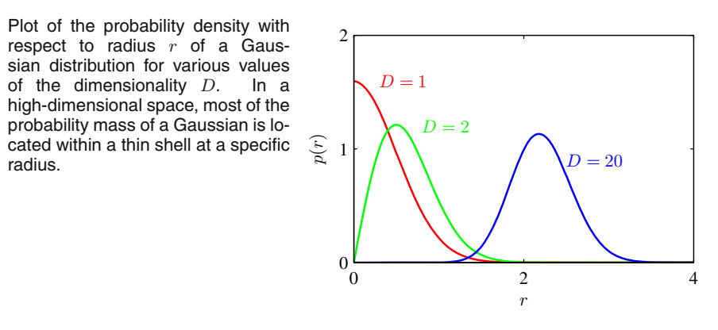

==The severe difficulty that can arise in spaces of many dimensions is sometimes called the *curse of dimensionality* (Bellman, 1961)==.   

Although the curse of dimensionality certainly raises important issues for pattern recognition applications, ==it does not prevent us from finding effective techniques applicable to high-dimensional spaces==.

1. First, real data will often be **confined to a region of the space having lower effective dimensionality**, and in particular the directions over which important variations in the target variables occur may be so confined.   
2. Second, real data will typically **exhibit some smoothness properties** (at least locally) so that for the most part small changes in the input variables will produce small changes in the target variables, and so we can exploit local interpolation-like techniques to allow us to make predictions of the target variables for new values of the input variables.   

***

## 1.5 Decision Theory

> Decision theory allows us to make optimal decisions in situations involving uncertainty such as those encountered in pattern recognition. 

**What we have:**

*  an input vector $\textrm{x}$
* target variables vector $\textrm{t}$

**Our goal:**

Predict $\textbf{t}$ given a new value for $\textrm{x}$

**For regression problems:**

> $\textbf{t}$ will comprise continuous variables

**For classification problems:**

> $\textbf{t}$ will represent class labels

The joint probability distribution $p(\textrm{x}, \textbf{t})$ provides a complete summary of the uncertainty associated with these variables. Determination of $p(\textrm{x}, \textbf{t})$ from a set of training data is an example of *inference*. 

**What the decision theory do:**

In a practical application, however, we must often make a specific prediction for the value of $\textbf{t}$, or more generally take a specific action based on our understanding of the values $\textbf{t}$ is likely to take.

**Problem case:**

**Problem:** a medical diagnosis problem in which we have taken an X-ray image of a patient, and we wish to determine whether the patient has cancer or not.

**Input:** input vector $\textbf{x}$ is the set of pixel intensities in the image  

**Output:** output variable $t$ will represent the presence of cancer, which we denote by the class $\mathcal{C}_1$, or the absence of cancer, which we denote by the class $\mathcal{C}_2$. We might choose t to be a binary variable such that $t=0$ corresponds to class $\mathcal{C}_1$ and $t=1$ corresponds to class $\mathcal{C}_2$.

**We transform the problem into:** The general inference problem then involves determining the joint distribution $p(\textbf{x},\mathcal{C}_k)$, or equivalently $p(\textbf{x},t)$, which gives us the most complete probabilistic description of the situation.

**What we should do:** we must decide either to give treatment to the patient or not, and we would like this choice to be optimal in some appropriate sense (Duda and Hart, 1973). This is the decision step, and it is the subject of decision theory to tell us how to make optimal decisions given the appropriate probabilities.

**How we might expect probabilities to play a role in making decisions:**

When we obtain the X-ray image $\textbf{x}$ for a new patient, our goal is to decide which of the two classes to assign to the image. We are interested in the probabilities of the two classes given the image, which are given by $p(\mathcal{C}_k|\textbf{x})$. Using Bayes’ theorem, these probabilities can be expressed in the form
$$
p(\mathcal{C}_k|\textbf{x})=\frac{p(\textbf{x}|\mathcal{C}_k)p(\mathcal{C}_k)}{p(\textbf{x})}\tag{1.77}
$$

* We can now interpret $p(\mathcal{C}_k)$ as the prior probability for the class $\mathcal{C}_k$.
* And $p(\mathcal{C}_k|\textbf{x})$ as the corresponding posterior probability.
* If our aim is to minimize the chance of assigning x to the wrong class, then intuitively we would choose the class having the higher posterior probability.

### 1.5.1 Minimizing the misclassification rate

**Our goal:**

Make as few misclassifications as possible.

**What we need:**

A rule that assigns each value of $\textbf{x}$ to one of the available classes. 

* Such a rule will <u>divide the input space into regions</u> $\mathcal{R}_k$ called *decision regions*, 
* one for each class, such that all points in $\mathcal{R}_k$ are <u>assigned to class</u> $\mathcal{C}_k$.
* The <u>boundaries between decision regions</u> are called *decision boundaries* or *decision surfaces*.

In order to find the optimal decision rule, consider first of all the case of two classes, as in the cancer problem for instance. A mistake occurs when an input vector belonging to class $\mathcal{C}_1$ is assigned to class $\mathcal{C}_2$ or vice versa. The probability of this occurring is given by
$$
\begin{align}
	p(\textrm{mistake}) &= p(\textbf{x}\in \mathcal{R}_2,\mathcal{C}_1)+p(\textbf{x}\in \mathcal{R}_1,\mathcal{C}_2)\\
	&=\int_{\mathcal{R}_1}p(\textbf{x},\mathcal{C}_2)\textrm{d}\textbf{x}+\int_{\mathcal{R}_2}p(\textbf{x},\mathcal{C}_1)\textrm{d}\textbf{x}\tag{1.78}
\end{align}
$$
**Our principle:**

To minimize $p(\textrm{mistake})$ we should arrange that each $\textbf{x}$ is assigned to whichever class has the smaller value of the integrand in (1.78). Thus, if $p(\textbf{x},\mathcal{C}_1)>p(\textbf{x},\mathcal{C}_2)$ for a given value of $\textbf{x}$, then we should assign that $\textbf{x}$ to class $\mathcal{C}_1$.

We have $p(\textbf{x},\mathcal{C}_k)=p(\mathcal{C}_k|\textbf{x})p(\textbf{x})$. Because the factor $p(\textbf{x})$ is common to both terms, we can assign $\textbf{x}$ to the class which has the largest posterior probability $p(\mathcal{C}_k|\textbf{x})$.

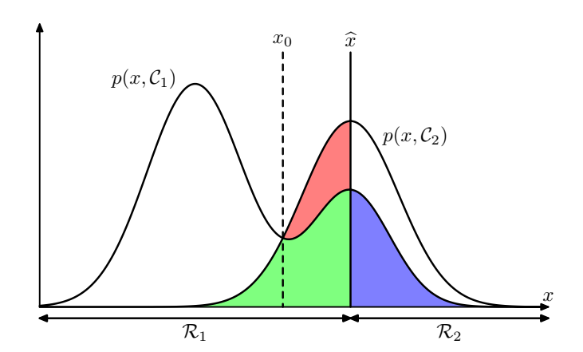

> Schematic illustration of the joint probabilities $p(\textbf{x},\mathcal{C}_k)$ for each of two classes plotted against $x$, together with the decision boundary $x = \hat{x}$. Values of $x\ge \hat{x}$ are classified as class $\mathcal{C}_2$ and hence belong to decision region $\mathcal{R}_2$, whereas points $x < \hat{x}$ are classified as $\mathcal{C}_1$ and belong to $\mathcal{R}_1$. Errors arise from the blue, green, and red regions, so that for $x < \hat{x}$ the errors are due to points from class $\mathcal{C}_2$ being misclassified as $\mathcal{C}_1$ (represented by the sum of the red and green regions), and conversely for points in the region $x\ge \hat{x}$ the errors are due to points from class $\mathcal{C}_1$ being misclassified as $\mathcal{C}_2$ (represented by the blue region). As we vary the location $\hat{x}$ of the decision boundary, the combined areas of the blue and green regions remains constant, whereas the size of the red region varies. The
> optimal choice for $\hat{x}$ is where the curves for $p(\textbf{x},\mathcal{C}_1)$ and $p(\textbf{x},\mathcal{C}_2)$ cross, corresponding to $\hat{x} = x_0$, because in this case the red region disappears. This is equivalent to the minimum misclassification rate decision rule, which assigns each value of $\textbf{x}$ to the class having the higher posterior probability $p(\mathcal{C}_k|x)$  

For the more general case of $K$ classes
$$
\begin{align}
	p(\textrm{correct})&=\sum_{k=1}^{K}p(\textbf{x}\in\mathcal{R_k,C_k})\\
	&=\sum_{k=1}^{K}\int_{\mathcal{R_k}}{p(\textbf{x},\mathcal{C_k})\textrm{d}\textbf{x}}\tag{1.79}
\end{align}
$$

* which is maximized when the regions $\mathcal{R_k}$ are chosen such that each $\textbf{x}$ is assigned to the class for which $p(\textbf{x},\mathcal{C_k})$ is largest.
* Again consider $p(\textbf{x},\mathcal{C_k})=p(\mathcal{C_k}|\textbf{x})p(\textbf{x})$, and noting that the factor of $p(\textbf{x})$ is common to all terms, we assigned each $\textbf{x}$ to the class having the largest posterior probability $p(\mathcal{C_k}|\textbf{x})$.

***

### 1.5.2 Minimizing the expected loss

For many applications, our objective will be more complex than simply minimizing the number of misclassifications.   

* If a patient who does not have cancer is incorrectly diagnosed as having cancer, the consequences may be some patient distress plus the need for further investigations.   
* Conversely, if a patient with cancer is diagnosed as healthy, the result may be premature death due to lack of treatment. 
* Thus the consequences of these two types of mistake can be dramatically different. It would clearly be better to make fewer mistakes of the second kind, even if this was at the expense of making more mistakes of the first kind.  

**Our goal:**

To minimize the total loss incurred.  

> We can formalize such issues through the introduction of a *loss function*, also called a *cost function*, which is a single, overall measure of loss incurred in taking any of the available decisions or actions.   

**Loss matrix:**

Suppose that, for a new value of $\textbf{x}$, the true class is $\mathcal{C}_k$ and that we assign $\textbf{x}$ to class $\mathcal{C}_k$ (where $j$ may or may not be equal to $k$). In so doing, we incur some level of loss that we denote by $\textit{L}_{kj}$, which we can view as the $k, j$ element of a loss matrix. For instance, in our cancer example, we might have a loss matrix  

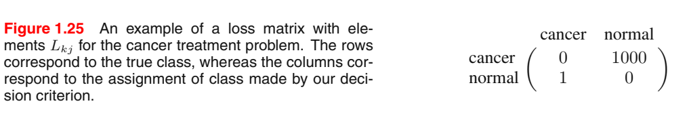

The optimal solution is the one which minimizes the loss function. <u>However, the loss function depends on the true class, which is unknown</u>. For a given input $\textbf{x}$, our uncertainty in the true class is expressed through the joint probability distribution $p(\textbf{x},\mathcal{C_k})$ and so we seek instead to minimize the **average loss**, where the average is computed with respect to this distribution, which is given by  
$$
\mathbb{E}[L]=\sum_k\sum_j\int_{\mathcal{R_j}}{L_{kj}p(\textbf{x},\mathcal{C_k})\textrm{d}\textbf{x}}\tag{1.80}
$$

> For every correct class $k$, for every class that it can be assigned $j$, we calculate the weighted $L_{kj}$ with <u>weights of $k$</u> $p(\textbf{x},\mathcal{C_k})$ go over the region $\mathcal{R_j}$.

Each $\textbf{x}$ can be assigned independently to one of the decision regions $\mathcal{R_j}$.  

**Then our goal:**

Our goal is to choose the regions $\mathcal{R_j}$ in order to minimize the expected loss (1.80), which implies that for each $\textbf{x}$ we should minimize $\sum_{k}{L_{kj}p(\textbf{x},\mathcal{C_k})}$.

As before we use $p(\textbf{x},\mathcal{C_k})=p(\mathcal{C_k}|\textbf{x})p(\textbf{x})$ to eliminate $p(\textbf{x})$. Thus the decision rule that minimizes the expected loss is the one that assigns each new $\textbf{x}$ to the class $j$ for which quantity
$$
\sum_{k}{L_{kj}p(\mathcal{C_k}|\textbf{x})}\tag{1.81}
$$

is a minimum.

***

### 1.5.3 The reject option

**Due to:**

We have seen that classification errors arise from the regions of input space where the largest of the posterior probabilities $p(\mathcal{C_k}|\textbf{x})$ is significantly less than unity, or equivalently where the joint distributions $p(\textbf{x},\mathcal{C_k})$ have comparable values. These are the regions where we are relatively uncertain about class membership. 

In some applications, it will be appropriate to avoid making decisions on the difficult cases in anticipation of a lower error rate on those examples for which a classification decision is made. This is known as the *reject option*.  

**For example:**

in our hypothetical medical illustration, it may be appropriate to use an automatic system to classify those X-ray images for which there is little doubt as to the correct class, <u>while leaving a human expert to classify the more ambiguous cases.</u>   

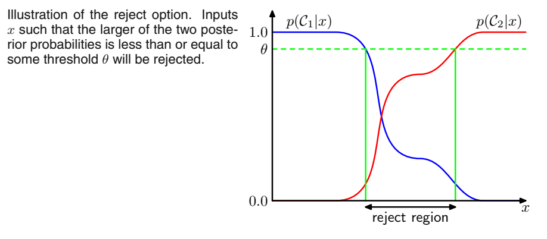

We can easily extend the reject criterion to minimize the expected loss, when a loss matrix is given, taking account of the loss incurred when a reject decision is made.

***

### 1.5.4 Inference and decision

* In *inference stage* we use training data to learn a model for $p(\mathcal{C_k}|\textbf{x})$
* In *decision stage* we use these posterior probabilities to make optimal class assignments.
* An alternative possibility would be to solve both problems together and simply learn a function that maps inputs x directly into decisions. Such a function is called a *discriminant function*.

In fact, we can identify three distinct approaches to solving decision problems, all of which have been used in practical applications.  

1. First solve the inference problem of determining the class-conditional densities $p(\textbf{x},\mathcal{C_k})$ for each class $\mathcal{C_k}$ individually. Also separately infer the prior class probabilities $p(\mathcal{C_k})$. Then use the Bayes' theorem in the form
   $$
   p(\mathcal{C_k}|\textbf{x})=\frac{p(\textbf{x}|\mathcal{C_k})p(\mathcal{C_k})}{p(\textbf{x})}\tag{1.82}
   $$
   to find the posterior class probabilities $p(\mathcal{C_k}|\textbf{x})$. As usual, the denominator in Bayes’ theorem can be found in terms of the quantities appearing in the numerator, be
   $$
   p(\textbf{x})=\sum_{k}{p(\textbf{x}|\mathcal{C_k})p(\mathcal{C_k})}\tag{1.83}
   $$
   Equivalently, we can model the joint distribution $p(\textbf{x},\mathcal{C_k})$ directly and then normalize to obtain the posterior probabilities. Having found the posterior
   probabilities, we use decision theory to determine class membership for each
   new input $\textbf{x}$​. ==Approaches that explicitly or implicitly model the distribution of inputs as well as outputs are known as *generative models*, because by sampling from them it is possible to generate synthetic data points in the input space==.

2. First solve the inference problem of determining the posterior class probabilities $p(\mathcal{C_k}|\textbf{x})$. and then subsequently use decision theory to assign each new $\textbf{x}$ to one of the classes. ==Approaches that model the posterior probabilities directly are called *discriminative models*==. 

3. Find a function $f(\textbf{x})$, called a discriminant function, which maps each input $\textbf{x}$ directly onto a class label. For instance, in the case of two-class problems, $f(\cdot)$ might be binary valued and such that $f=0$ represents class $\mathcal{C}_1$ and $f=1$ represents class $\mathcal{C}_2$. In this case, probabilities play no role. 

Approach 1: 

* Advantage: Most demanding because it involves finding the joint distribution over both $\textbf{x}$ and $\mathcal{C}_k$. It also allows the marginal density of data $p(\textbf{x})$ to be determined from (1.83). <u>Useful for detecting new data points that have low probability under the model and for which the predictions may  be of low accuracy, which is known as *outlier detection* or *novelty detection*.</u>  
* Disadvantage: Wasteful of computational resources, and excessively demanding of data. Posterior probabilities can be obtained directly through approach 2.

Approach 3:

* Advantage: Simpler.
* Disadvantage: no access to the posterior probabilities $p(\mathcal{C_k}|\textbf{x})$. We need to compute the posterior probabilities for
  * **Minimizing risk**. Revise the minimum risk decision criterion by modifying (1.81) appropriately. If we have only a discriminant function, then any change to the loss matrix would require that we return to the training data and solve the classification problem afresh.  
  * **Reject option**. Posterior probabilities allow us to determine a rejection criterion.
  * **Compensating for class priors**. <u>For unbalanced dataset</u>, we have selected equal numbers of examples from each of the classes would allow us to find a more accurate model. However, we then have to compensate for the effects of our modifications to the training data. From Bayes’ theorem (1.82), we see that <u>the posterior probabilities are proportional to the prior probabilities</u>, which we can interpret as the fractions of points in each class. We can therefore simply <u>take the posterior probabilities obtained from our artificially balanced data set and first divide by the class fractions in that data set and then multiply by the class fractions in the population to which we wish to apply the model.</u>  
  * **Combining models**. Rather than combine all of this heterogeneous information into one huge input space, it may be more effective to build one system to interpret the X-ray images and a different one to interpret the blood data.  

***

### 1.5.5 Loss functions for regresstions

The decision stage consists of choosing a specific estimate $y(\textbf{x})$ of the value of $t$ for each input $\textbf{x}$.

The average, or expected, loss is then given by
$$
\mathbb{E}[L]=\iint{L(t,y(\textbf{x}))p(\textbf{x},t)\textrm{d}\textbf{x}\textrm{d}t}\tag{1.86}
$$
A common choice of loss function in regression problems is the squared loss
$$
\mathbb{E}[L]=\iint{\{y(\textbf{x})-t\}^2p(\textbf{x},t)\textrm{d}\textbf{x}\textrm{d}t}\tag{1.87}
$$
**Our goal:**

Choose $y(\textbf{x})$ so as to minimize $\mathbb{E}[L]$.

**Assume a completely flexible function** $y(\textbf{x})$, we can do this formally using the calculus of variations to give
$$
\frac{\delta\mathbb{E}[L]}{\delta y(\textbf{x})}=2\int\{y(\textbf{x})-t\}p(\textbf{x},t)\textrm{d}t=0\tag{1.88}
$$
Solving for $y(\textbf{x})$
$$
\begin{align}
	2\int y(\textbf{x})p(\textbf{x},t)\textrm{d}t&=2\int tp(\textbf{x},t)\textrm{d}t\\
	y(\textbf{x})\int p(\textbf{x},t)\textrm{d}t&=\int tp(\textbf{x},t)\textrm{d}t\\
	y(\textbf{x})p(\textbf{x})&=\int tp(\textbf{x},t)\textrm{d}t\\
	y(\textbf{x})&=\frac{\int tp(\textbf{x},t)\textrm{d}t}{p(\textbf{x})}=\int tp(t|\textbf{x})\textrm{d}t=\mathbb{E}_t[t|\textbf{x}]\tag{1.89}
\end{align}
$$
which is the conditional average of $t$ conditioned on $\textbf{x}$ and is known as the *regression function*.

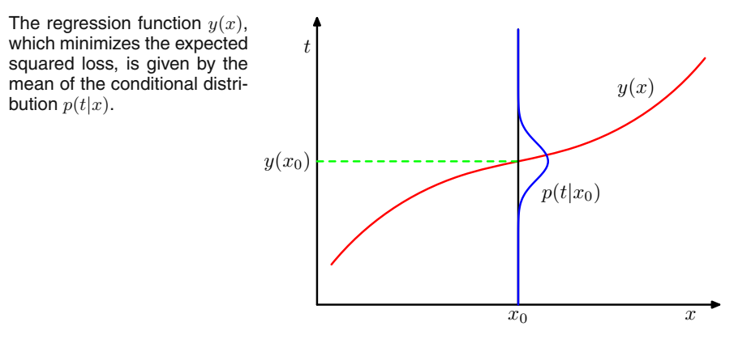

**A slightly different way:**

Armed with the knowledge that the optimal solution is the conditional expectation, we can expand the square term as follows  
$$
\begin{align}
	\{y(\textbf{x})-t\}^2&=\{y(\textbf{x})-\mathbb{E}[t|\textbf{x}]+\mathbb{E}[t|\textbf{x}]-t\}^2\\
	&=\{y(\textbf{x})-\mathbb{E}[t|\textbf{x}]\}^2+2\{y(\textbf{x})-\mathbb{E}[t|\textbf{x}]\}\{\mathbb{E}[t|\textbf{x}]-t\}+\{\mathbb{E}[t|\textbf{x}]-t\}^2
\end{align}
$$
Substituting into the loss function and performing the integral over $t$, we see that the cross-term vanishes 

==why the cross-term vanished???==

and we obtain an expression for the loss function in the form
$$
\mathbb{E}[L]=\int\{y(\textbf{x})-\mathbb{E}[t|\textbf{x}]\}^2p(\textbf{x})\textrm{d}\textbf{x}+\int \{\mathbb{E}[t|\textbf{x}]-t\}^2p(\textbf{x})\textrm{d}\textbf{x}\tag{1.90}
$$

* The function $y(\textbf{x})$ we seek to determine enters only in the first term, which will be minimized when  $y(\textbf{x})$ is equal to $\mathbb{E}[t|\textbf{x}]$, in which case this term will vanish.
* The second term is the ==variance== of the distribution of $t$, averaged over $\textbf{x}$. It represents the <u>intrinsic variability of the target data and can be regarded as noise.</u>  Because it is independent of $y(\textbf{x})$, it represents the <u>irreducible minimum value of the loss function.</u>  

Indeed, we can identify three distinct approaches to solving regression problems

1. First solve the inference problem of determining the joint density $p(\textbf{x}, t)$. Then normalize to find the conditional density $p(t|\textbf{x})$, and finally marginalize to find the conditional mean given by (1.89).  
2. First solve the inference problem of determining the conditional density $p(t|\textbf{x})$, and then subsequently marginalize to find the conditional mean given by (1.89).  
3. Find a regression function $y(\textbf{x})$ directly from the training data.

The squared loss is not the only possible choice of loss function for regression. Such as *Minkowski* loss, whose expection is given by
$$
\mathbb{E}[L_q]=\iint|y(\textbf{x})-t|^qp(\textbf{x},t)\textrm{d}\textbf{x}\textrm{d}t\tag{1.91}
$$

***

## 1.6 Information theory

> We close this chapter by introducing some additional concepts from the field of information theory, which will also prove useful in our development of pattern recognition and machine learning techniques.   

**Intro to entropy:**

**We have:** a discrete random variable $x$

**We ask:** how much information is received when we observe a specific value for this variable

| How possible | How much information |
| ------------ | -------------------- |
| improbable   | most                 |
| likely       | middle               |
| certain      | least                |

**We look for:** a quantity $h(x)$ that is a monotonic function of the probability $p(x)$ and that expresses the information content.   

**We have:**
$$
h(x)=-\log_2{p(x)}\tag{1.92}
$$

* the negative sign ensures that information is positive or zero.
* low probability events #$x$ correspond to high information content.
* using logarithms to the base of 2, the units of $h(x)$ are bits('binary digits'), while the base of e get nats.

The average amount of information
$$
\textrm{H}[x]=-\sum_{x}p(x)\log_2{p(x)}\tag{1.93}
$$
called *entropy* of the random variable $x$.

> If $p(x)=0$ then the entropy is $0$.

This relation between entropy and shortest coding length is a general one. The *noiseless coding theorem* (Shannon, 1948) states that the entropy is a lower bound on the number of bits needed to transmit the state of a random variable.  

**A prospective of entropy in physics:**

**Considering:**

A set of $N$ identical objects that are to be divided amongst a set of bins, such that there are $n_i$ objects in the $i^{th}$ bin.

There are $N$ ways to choose the first object, $(N-1)$ ways to choose the second object, and so on, leading to a total of $N!$ ways to allocate all $N$ objects to the bins.

In order eliminate the order in each bin, in the $i^{th}$ bin there are $n_i!$ ways of reordering the objects, and so the total number of ways of allocating the $N$ objects to the bins is given by
$$
W=\frac{N!}{\prod_in_i!}\tag{1.94}
$$
which is called the *multiplicity*. The entropy is then defined as the logarithm of the multiplicity scaled by an appropriate constant
$$
\textrm{H}=\frac{1}{N}\ln{W}=\frac{1}{N}\ln{N!}-\frac{1}{N}\sum_i{\ln{n_i!}}\tag{1.95}
$$
We now consider the limit $N\rightarrow\infty$, in which the fractions $n_i/N$ are held fixed, and apply Stirling’s approximation
$$
\ln{N!}\simeq N\ln{N}-N\tag{1.96}
$$
which gives
$$
\begin{align}
	\textrm{H}&=\ln{N}-1-\frac{1}{N}\sum_i{n_i\ln{n_i}}+1 \\
	\textrm{H}&=\frac{1}{N}\sum_in_i\ln{N}-\frac{1}{N}\sum_i{n_i\ln{n_i}} \\
	\textrm{H}&=\frac{1}{N}\sum_i\ln{\frac{N^{n_i}}{n_i^{n_i}}} \\
	\textrm{H}&=-\lim_{N\rightarrow\infty}{\sum_i\left(\frac{n_i}{N}\right)\ln{\left(\frac{n_i}{N}\right)}}=-\sum_i{p_i\ln{p_i}}\tag{1.97}
\end{align}
$$
In physics terminology, the specific arrangements of objects in the bins is called a *microstate*, and the overall distribution of occupation numbers, expressed through the ratios $n_i/N$, is called a *macrostate*. The multiplicity W is also known as the weight of the *macrostate*.  

The entropy of the random variable $X$ is then
$$
\textrm{H}[p]=-\sum_ip(x_i)\ln{p(x_i)}\tag{1.98}
$$

| Shape                                 | Entropy |
| ------------------------------------- | ------- |
| sharply peaked around a few values    | lower   |
| spread more evenly across many values | higher  |

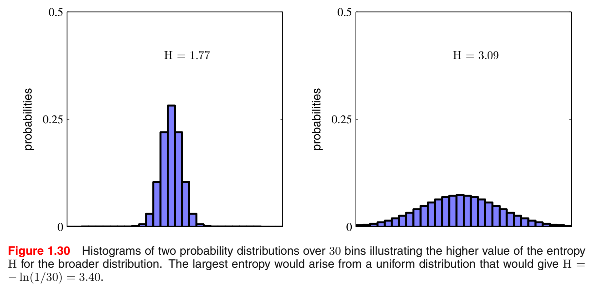

**To find the maximum entropy configuration:**

Using a Lagrange multiplier:
$$
\tilde{\textrm{H}}=-\sum_{i}{p(x_i)\ln{p(x_i)}+\lambda\left(\sum_i{p(x_i)-1}\right)}\tag{1.99}
$$

* From which we find that all of the $p(x_i)$ are equal and are given by $p(x_i)=1/M$ where $M$ is the total states of $x_i$.
* The corresponding value of the entropy is then $\textrm{H}=\ln{M}$.

We can evaluate the second derivative of the entropy, which gives
$$
\frac{\partial\tilde{\textrm{H}}}{\partial p(x_i)\partial p(x_j)}=-I_{ij}\frac{1}{p_i}\tag{1.100}
$$
where $I_{ij}$ are the elements of the identity matrix.

**Extend the definition of entropy to include distributions $p(x)$ over continuous variables $x$:**   

According to the *mean value theorem*, we have
$$
\int_{i\Delta}^{(i+1)\Delta}p(x)\textrm{d}x=p(x_i)\Delta\tag{1.101}
$$
This gives a discrete distribution for which the entropy takes the form
$$
\textrm{H}_\Delta=-\sum_i{p(x_i)\Delta\ln(p(x_i)\Delta)}=-\sum_ip(x_i)\Delta\ln{p(x_i)}-\ln\Delta\tag{1.102}
$$
where $\sum_ip(x_i)\Delta=1$. Omit the $\ln\Delta$ and then consider the limit $\Delta\rightarrow0$. The first term on the right-hand side of (1.102) will approach the integral of $p(x) \ln p(x)$ in this limit so that
$$
\lim_{\Delta\rightarrow0}\{\sum_ip(x_i)\Delta\ln{p(x_i)}\}=-\int{p(x)\ln{p(x)}\textrm{d}x}\tag{1.103}
$$
where the quantity on the right-hand side is called the *differential entropy*.

Note that as $\Delta\rightarrow0$ the $\ln\Delta$ diverges. This reflects the fact that to specify a continuous variable very precisely requires a large number of bits.

For a density defined over multiple continuous variables, denoted collectively by the vector $\textbf{x}$, the differential entropy is given by
$$
\textrm{H}[\textbf{x}]=-\int{p(\textbf{x})\ln{p(\textbf{x})}\textrm{d}\textbf{x}}\tag{1.104}
$$
**To find the maximum entropy configuration of continuous:**

three constraints:
$$
\begin{align}
	\int_{-\infty}^{\infty}p(x)\textrm{d}x &= 1\tag{1.105}\\
	\int_{-\infty}^{\infty}xp(x)\textrm{d}x &= \mu\tag{1.106}\\
	\int_{-\infty}^{\infty}(x-\mu)^2p(x)\textrm{d}x &= \sigma^2\tag{1.107}\\
\end{align}
$$
Using Lagrange multipliers:
$$
-\int_{-\infty}^{\infty}p(x)\ln{p(x)}\textrm{d}x+\lambda_1\left(\int_{-\infty}^{\infty}p(x)\textrm{d}x-1\right)\\
+\lambda_2\left(\int_{-\infty}^{\infty}xp(x)\textrm{d}x - \mu\right)+\lambda_3\left(\int_{-\infty}^{\infty}(x-\mu)^2p(x)\textrm{d}x - \sigma^2 \right)
$$
Using the calculus of variations, we set the derivative of this functional to zero giving
$$
p(x)=\exp\{-1+\lambda_1+\lambda_2x+\lambda_3(x-\mu)^2 \}\tag{1.108}
$$
Back substitution,  we get
$$
p(x)=\frac{1}{(2\pi\sigma^2)^{1/2}}\ \exp\left\{-\frac{(x-\mu)^2}{2\sigma^2} \right\}\tag{1.109}
$$
==and so the distribution that maximizes the differential entropy is the Gaussian.==

If we evaluate the differential entropy of the Gaussian, we obtain
$$
\textrm{H}[x]=\frac{1}{2}\{1+\ln(2\pi\sigma^2)\}\tag{1.110}
$$

* Thus we see again that the entropy increases as the distribution becomes broader, i.e., as $\sigma^2$ increases.
* The differential entropy, unlike the discrete entropy, can be negative, because $\textrm{H}(x)<0$ in (1.110) for $\sigma^2<1/(2\pi e)$.

**Conditional entropy:**

Suppose we have a joint distribution $p(\textbf{x,y})$. If $\textbf{x}$ is already known, then the information needed to specify the corresponding value of $\textbf{y}$ is given by $\ln p(\textbf{y|x})$. Thus the average additional information needed to specify $\textbf{y}$ can be written as
$$
\textrm{H}[\textbf{y|x}]=-\iint p(\textbf{y,x})\ln{p(\textbf{y,x})}\textrm{d}\textbf{y}\textrm{d}\textbf{x}\tag{1.111}
$$
which is called the *conditional entropy* of $\textbf{y}$ given $\textbf{x}$.

It satisfied
$$
\textrm{H}[\textbf{x,y}]=\textrm{H}[\textbf{y|x}]+\textrm{H}[\textbf{x}]\tag{1.112}
$$
Thus the information needed to describe $\textbf{x}$ and $\textbf{y}$ is given by the sum of the information needed to describe $\textbf{x}$ alone plus the additional information required to specify $\textbf{y}$ given $\textbf{x}$.  

***

### 1.6.1 Relative entropy and mutual information

> We now start to relate these ideas to pattern recognition.  

#### **KL-divergence**

**Suppose:**

Some unknown distribution $p(\textbf{x})$, we have modeled this using an approximating distribution $q(\textbf{x})$.

then the average *additional* amount of information (in nats) required to specify the value of $\textbf{x}$ as a result of using $q(\textbf{x})$ instead of the true distribution $p(\textbf{x})$ is given by
$$
\begin{align}
	\textrm{KL}(p||q) &= -\int p(\textbf{x})\ln q(\textbf{x})\textrm{d}\textbf{x}-\left(-\int p(\textbf{x})\ln p(\textbf{x})\textrm{d}\textbf{x}\right)\\
	&= -\int p(\textbf{x})\ln \left\{\frac{q(\textbf{x})}{p(\textbf{x})}\right\}\textrm{d}\textbf{x}\tag{1.113}
\end{align}
$$
This is known as the *relative entropy* or *Kullback-Leibler divergence*, or *KL divergence* (Kullback and Leibler, 1951), between the distributions $p(\textbf{x})$ and $q(\textbf{x})$.

* $\textrm{KL}(p||q)\not\equiv \textrm{KL}(q||p)$
* $\textrm{KL}(p||q)\ge0$ if and only if $p(\textbf{x})=q(\textbf{x})$

To prove the property  of the second one, we use
$$
f\left(\sum_{i=1}^M\lambda_ix_i\right)\le\sum_{i=1}^{M}\lambda_if(x_i)\tag{1.115}
$$
for a convex function $f(x)$ where $\lambda_i\ge0$ and $\sum_i\lambda_i=1$. It is also known as *Jensen's inequality*. If we interpret the $λ_i$ as the probability distribution over a discrete variable $x$ taking the values $\{x_i\}$, then (1.115) can be written
$$
f(\mathbb{E}[x])\le\mathbb{E}[f(x)]\tag{1.116}
$$
For continuous variables:
$$
f\left(\int \textbf{x}p(\textbf{x})\textrm{d}\textbf{x}\right)\le\int f(\textbf{x})p(\textbf{x})\textrm{d}\textbf{x}\tag{1.117}
$$
Apply to (1.113):
$$
\textrm{KL}(p||q) =-\int p(\textbf{x})\ln \left\{\frac{q(\textbf{x})}{p(\textbf{x})}\right\}\textrm{d}\textbf{x}\ge-\ln\int q(\textbf{x})\textrm{d}\textbf{x}=0\tag{1.118}
$$
**How we evaluate our generated model using KL-divergence:**

<u>$p(\textbf{x})$ is unknown</u>, We can try to approximate this distribution using some parametric distribution $q(\textbf{x}|\mathbf{\theta})$.

One way to determine $\mathbf{\theta}$ is to minimize the Kullback-Leibler divergence between $p(\textbf{x}) $ and $q(\textbf{x}|\mathbf{\theta})$ with respect to $\mathbf{\theta}$.   

Suppose, however, that we have observed a finite set of training points $\textbf{x}_n$, for $n = 1, . . . , N$, drawn from $p(\textbf{x}) $. Then the expectation with respect to $p(\textbf{x}) $ can be approximated by a finite sum over these points, using (1.35), so that
$$
\textrm{KL}(p||q) \simeq \sum_{n=1}^N\{-\ln q(\textbf{x}_n|\mathbf{\theta})+\ln p(\textbf{x}_n) \}\tag{1.119}
$$

* The second term on the right-hand side of (1.119) is independent of $\mathbf{\theta}$
* The first term is the negative log likelihood function for $\mathbf{\theta}$ under the distribution $q(\textbf{x}|\mathbf{\theta})$ evaluated using the training set.

Thus we see that minimizing this Kullback-Leibler divergence is equivalent to maximizing the likelihood function.  

**Using KL-divergence to judge how independent two random variables are: mutual information**

If the variables are not independent, we can gain some idea of whether they are ‘close’ to being independent by considering the Kullback-Leibler divergence between the joint distribution and the product of the marginals, given by
$$
\begin{align}
	\textrm{I}[\textbf{x},\textbf{y}]&\equiv \textrm{KL}(p(\textbf{x},\textbf{y})||p(\textbf{x})p(\textbf{y}))\\
	&=-\iint p(\textbf{x},\textbf{y})\ln(\frac{p(\textbf{x})p(\textbf{y})}{p(\textbf{x,y})})\textrm{d}\textbf{x}\textrm{d}\textbf{y}\tag{1.120}
\end{align}
$$
which is called the *mutual information*

* $I(\textbf{x,y})\ge0$ if and only if $\textbf{x}$ and $\textbf{y}$ are independent

we see that the mutual information is related to the conditional entropy through
$$
\textrm{I}[\textbf{x},\textbf{y}]=\textrm{H}[\textbf{x}]-\textrm{H}[\textbf{x|y}]=\textrm{H}[\textbf{y}]-\textrm{H}[\textbf{y|x}]\tag{1.121}
$$

* Thus we can view the mutual information as the reduction in the uncertainty about $\textbf{x}$ by virtue of being told the value of $\textbf{y}$ (or vice versa).  
* From a Bayesian perspective, the mutual information therefore represents the reduction in uncertainty about $\textbf{x}$ as a consequence of the new observation $\textbf{y}$.  
