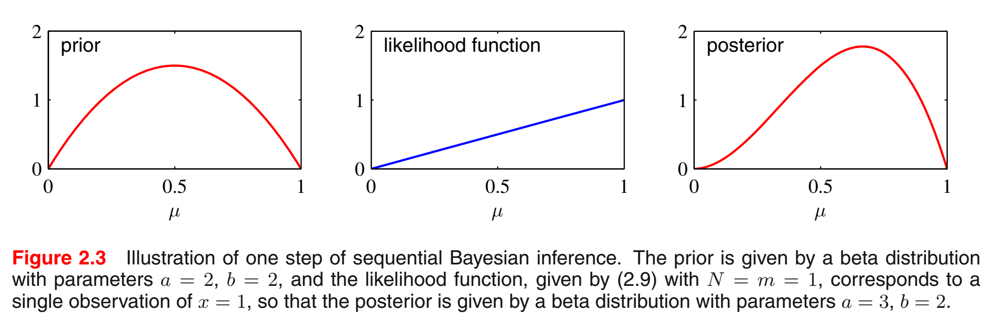
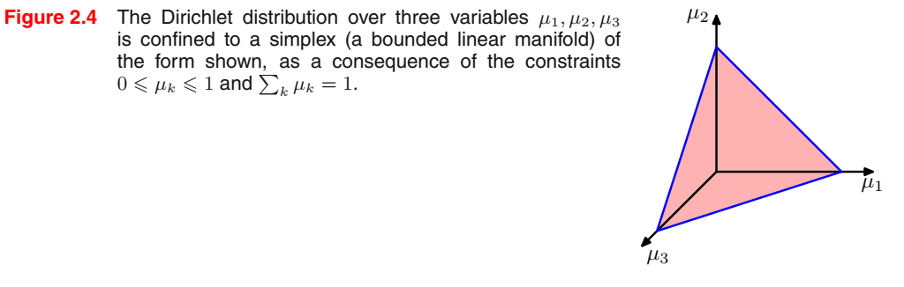
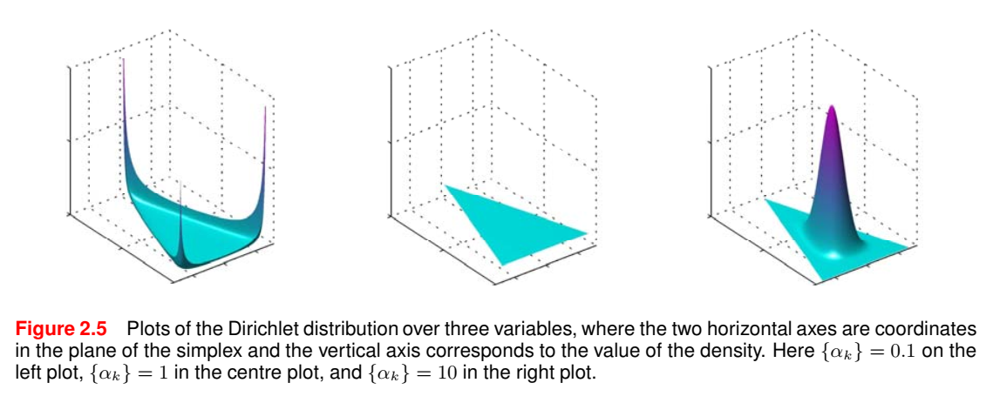
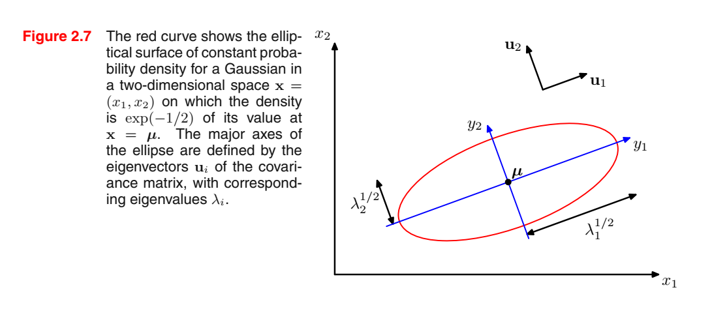
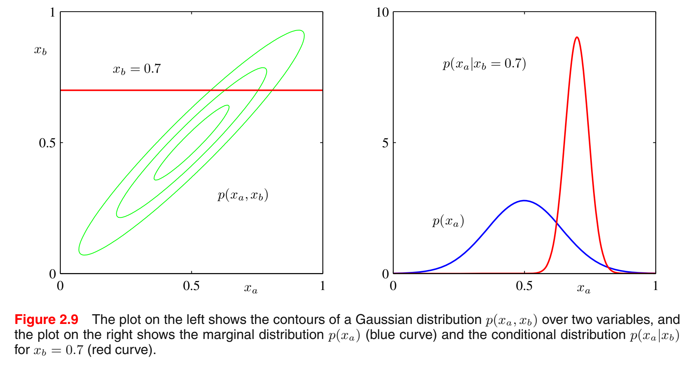
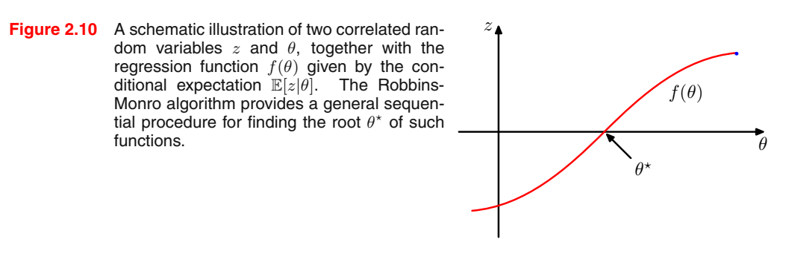
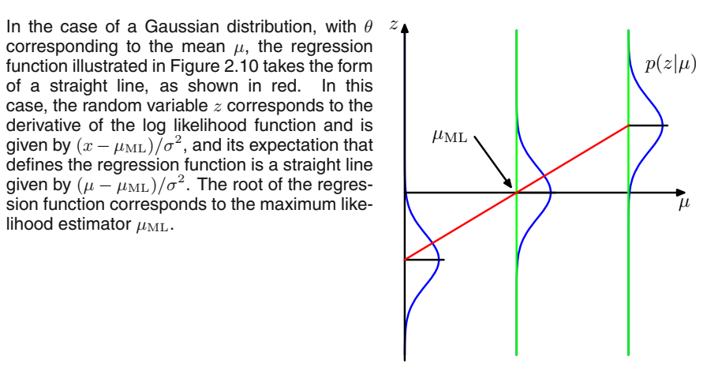

# Probability Distributions

[toc]

***

## 2.1 Binary Variables

#### Binary Distribution

$$
\begin{align}
	x&\in \{ 0,1 \}\\
	p(x&=1|\mu)=\mu\tag{2.1}\\
	p(x&=0|\mu)=1-\mu\\
	0&\le\mu\le1
\end{align}
$$

#### Bernoulli Distribution

$$
\begin{align}
	\textrm{Bern}(x|\mu)&=\mu^x(1-\mu)^{1-x}\tag{2.2}\\
	\mathbb{E}[x]&=\mu\tag{2.3}\\
	\textrm{var}[x]&=\mu(1-\mu)\tag{2.4}
\end{align}
$$

Now suppose we have a data set $\mathcal{D}=\{x_1,_\cdots,x_N \}$, of observed values of $x$. We can construct the likelihood function, which is a function of $\mu$, on the assumption that the observations are drawn independently from $p(x|\mu)$, so that
$$
p(\mathcal{D}|\mu)=\prod_{n=1}^{N}p(x_n|\mu)=\prod_{n=1}^{N}\mu^{x_n}(1-\mu)^{1-x_n}\tag{2.5}
$$
The log likelihood function is given by
$$
\ln{p(\mathcal{D}|\mu)}=\sum_{n=1}^{N}\ln p(x_n|\mu)=\sum_{n=1}^{N}\{x_n\ln\mu+(1-x_n)\ln(1-\mu) \}\tag{2.6}
$$
The sum $\sum_nx_n$ provides an example of a sufficient statistic for the data under this distribution. We then derivate with respect to $\mu$
$$
\mu_{ML}=\frac{1}{N}\sum_{n=1}^{N}x_n\tag{2.7}
$$
which is also known as the *sample mean*. And we denote the number of observations of $x=1$ within this data set by $m$, wecan rewrite (2.7) in the form
$$
\mu_{ML}=\frac{m}{N}\tag{2.8}
$$

#### Binomial Distribution

> Distribution of the number $m$ of observations of $x = 1$ given that the data set has size $N$.  

$$
\begin{align}
	\textrm{Bin}(m|N,\mu)&=\binom{N}{m}\mu_m(1-\mu)^(N-m)\tag{2.9}\\
	\binom{N}{m}&\equiv\frac{N!}{(N-m)!m!}\tag{2.10}\\
	\mathbb{E}[m]&\equiv\sum_{m=0}^{N}m\textrm{Bin}(m|N,\mu)\ =\ N\mu\tag{2.11}\\
	\textrm{var}[m]&\equiv\sum_{m=0}^{N}(m-\mathbb{E}[m])^2\textrm{Bin}(m|N,\mu)\ =\ N\mu(1-\mu)\tag{2.12}
\end{align}
$$

### 2.1.1 The beta distribution

#### Conjugacy

> If we choose a prior to be proportional to powers of $\mu$ and $1-\mu$, then the posterior distribution, which is proportional to the product of the prior and the likelihood function, will have the same functional form as the prior. This property is called *conjugacy* and we will see several examples of it later in this chapter.  

#### Beta distribution

$$
\begin{align}
	\textrm{Beta}(\mu|a,b)&=\frac{\Gamma(a+b)}{\Gamma(a)\Gamma(b)}\mu^{a-1}(1-\mu)^{b-1}\tag{2.13}\\
	\Gamma(x)\textrm{ is the gamma}&\textrm{ function defined by (1.141)}\\
	\int\textrm{Beta}(\mu|a,b)\textrm{d}\mu&=1\tag{2.14}\\
	\mathbb{E}[\mu]&=\frac{a}{a+b}\tag{2.15}\\
	\textrm{var}[\mu]&=\frac{ab}{(a+b)^2(a+b+1)}\tag{2.16}
\end{align}
$$

The parameters $a$ and $b$ are often called *hyperparameters* because they control the distribution of the parameter $µ$.  

The posterior distribution of $µ$ is now obtained by multiplying the beta prior (2.13) by the binomial likelihood function (2.9) and normalizing. 

==Why multiply the binomial likelihood?==
$$
p(\mu|m,l,a,b)\propto\mu^{m+a-1}(1-\mu)^{l+b-1}\tag{2.17}
$$

* $l=N-m$
* (2.17) has the same functional dependence on µ as the prior distribution, reflecting the conjugacy properties of the prior with respect to the likelihood function.  

Indeed, it is simply another beta distribution, and its normalization coefficient can therefore be obtained by comparison with (2.13) to give
$$
p(\mu|m,l,a,b)=\frac{\Gamma(m+a+l+b)}{\Gamma{(m+a)}\Gamma{(l+b)}}\mu^{m+a-1}(1-\mu)^{l+b-1}\tag{2.18}
$$

* We observe $m$ observations of $x=1$ and $l$ observations of $x=0$ has been increase the value of $a$ by $m$ and $b$ by $l$, in going from the prior distribution to the posterior distribution.
* $a$ and $b$ in the prior are *effective number of observations* of $x=1$ and $x=0$.

**Furthermore, the posterior distribution can act as the prior if we subsequently observe additional data.**

1. Taking observations one at a time
2. After each observation updating the current posterior distribution by multiplying by the likelihood function for the new observation and then normalizing to obtain the new, revised posterior distribution.
3. At each stage, the posterior is a beta distribution with some total number of (prior and actual) observed values for $x = 1$ and $x = 0$ given by the parameters $a$ and $b$.  
4. Incorporation of an additional observation of $x = 1$ simply corresponds to incrementing the value of $a$ by $1$, whereas for an observation of $x = 0$ we increment $b$ by $1$.  

The evaluation of the predictive distribution of $x$ given $\mathcal{D}$
$$
p(x=1|\mathcal{D})=\int_{0}^{1}p(x=1|\mu)p(\mu|\mathcal{D})\textrm{d}\mu=\int_{0}^{1}\mu p(\mu|\mathcal{D})\textrm{d}\mu=\mathbb{E}[\mu|\mathcal{D}]\tag{2.19}
$$
Using the (2.18) for the posterior distribution $p(\mu|\mathcal{D})$, together with (2.15) for the mean of the beta distribution, we obtain
$$
p(x=1|\mathcal{D})=\frac{m+a}{m+a+l+b}\tag{2.20}
$$

> The total fraction of observations (both real observations and fictitious prior observations) that correspond to $x = 1$ 

Whether as we observe more and more data, the uncertainty represented by the posterior distribution will steadily decrease?

Consider a general Bayesian inference for parameter $\theta$ for which we observed a data set $\mathcal{D}$, described by the joint distribution $p(\theta,\mathcal{D})$.The following result
$$
\mathbb{E}_\boldsymbol{\theta}[\boldsymbol{\theta}]=\mathbb{E}_\mathcal{D}[\mathbb{E}_\boldsymbol{\boldsymbol{\theta}}[\boldsymbol{\theta}|\mathcal{D}]]\tag{2.21}
$$
where
$$
\begin{align}
	\mathbb{E}_\boldsymbol{\theta}[\boldsymbol{\theta}]&\equiv \int p(\boldsymbol{\theta})\boldsymbol{\theta}\textrm{d}\boldsymbol{\theta}\tag{2.22}\\
	\mathbb{E}_\mathcal{D}[\mathbb{E}_\boldsymbol{\theta}[\boldsymbol{\theta}|\mathcal{D}]]&\equiv\int\{\int\boldsymbol{\theta}_p(\boldsymbol{\theta}|\mathcal{D})\textrm{d}\boldsymbol{\theta} \}p(\mathcal{D})\textrm{d}\mathcal{D}\tag{2.23}
\end{align}
$$
says that the posterior mean of $\boldsymbol{\theta}$, averaged over the distribution generating the data, is equal to the prior mean of $\boldsymbol{\theta}$. Similarly,
$$
\textrm{var}_\boldsymbol{\theta}[\boldsymbol{\theta}]=\mathbb{E}_\mathcal{D}[\textrm{var}_\boldsymbol{\theta}[\boldsymbol{\theta}|\mathcal{D}]]+\textrm{var}_\mathcal{D}[\mathbb{E}_\boldsymbol{\theta}[\boldsymbol{\theta}|\mathcal{D}]]\tag{2.24}
$$

* The term on the left-hand side of (2.24) is the prior variance of $\boldsymbol{\theta}$
* On the right-hand side, the first term is the average posterior variance of $\boldsymbol{\theta}$, and the second term measures the variance in the posterior mean of $\boldsymbol{\theta}$.
* Note, however, that this result only holds on average.

***

## 2.2 Multinomial Variables

**We consider:**

$1$-of-$K$ scheme in which the variable is represented by a $K$-dimensional vector $\textbf{x}$ ==in which one of the elements $x_k$ equals $1$, and all remaining elements equal $0$.==

Take $K=6$ and $x_3=1$ as an example:
$$
\textbf{x}=(0,0,1,0,0,0)^\textrm{T}\tag{2.25}
$$
We denote the probability of $x_k=1$ by the parameter $\mu_k$, then the distribution of $\textbf{x}$:
$$
p(\textbf{x}|\boldsymbol{\mu})=\prod_{k=1}^{K}\mu_k^{x_k}\tag{2.26}
$$
where $\boldsymbol{\mu}=(\mu_1,_\cdots,\mu_K)^\textrm{T}$ satisfy $\mu_k\ge0$ and $\sum_k\mu_k=1$
$$
\sum_\textbf{x}p(\textbf{x}|\boldsymbol{\mu})=\sum_{k=1}^{K}\mu_k=1\tag{2.27}
$$
and that
$$
\mathbb{E}[\textbf{x}|\boldsymbol{\mu}]=\sum_\textbf{x}p(\textbf{x}|\boldsymbol{\mu})\textbf{x}=\boldsymbol{\mu}\tag{2.28}
$$
The corresponding likelihood function takes the form  
$$
p(\mathcal{D}|\boldsymbol{\mu})=\prod_{n=1}^N\prod_{k=1}^K\mu_k^{x_{nk}}=\prod_{k=1}^K\mu_k^{(\sum_nx_{nk})}=\prod_{k=1}^K\mu_k^{m_k}\tag{2.29}
$$
The likelihood function depends on the N data points only through the $K$ quantities
$$
m_k=\sum_nx_{nk}\tag{2.30}
$$
which represent the number of observations of $x_k=1$. These are called the *sufficient statistics* for this distribution.

Solve $\boldsymbol{\mu}$ using Lagrange multiplier $\lambda$
$$
\sum_{k=1}^Km_k\ln\mu_k+\lambda(\sum_{k=1}^K\mu_k-1)\tag{2.31}
$$
Derivative with respect to $\mu_k$ to zero, we obtain
$$
\mu_k=-m_k/\lambda\tag{2.32}
$$
Solve the $lambda$ give $\lambda=-N$, thus
$$
\mu_k^{ML}=\frac{m_k}{N}\tag{2.33}
$$
which is the fraction of the $N$ observations for which $x_k = 1$.  

#### Multinomial distribution

Consider the joint distribution of the quantities $m_1,_\cdots,m_K$, conditioned on $\boldsymbol{\mu}$ on $N$ observations. From (2.29) this takes the form
$$
\textrm{Mult}(m_1,m_2,_\cdots,m_K|\boldsymbol{\mu},N)=\binom{N}{m_1m_2{_\cdots}m_K}\prod_{k=1}^{K}\mu_k^{m_k}\tag{2.34}
$$
which is known as *multinomial distribution*.

### 2.2.1 The Dirichlet distribution

By inspection of the form of the multinomial distribution, we see that the conjugate prior is given by  
$$
p(\boldsymbol{\mu}|\boldsymbol{\alpha})\propto\prod_{k=1}^K\mu_k^{\alpha_k-1}\tag{2.37}
$$

* $\boldsymbol{\alpha}$ denotes $(\alpha_1,_\cdots,\alpha_K)^{\textrm{T}}$

Note that, because of the summation constraint, the distribution over the space of the {µk} is confined to a *simplex* of dimensionality K - 1, as illustrated for K = 3 in Figure 2.4.  

#### Dirichlet distribution

The normalized form for this distribution is by  
$$
\textrm{Dir}(\boldsymbol{\mu}|\boldsymbol{\alpha})=\frac{\Gamma(\alpha_0)}{\Gamma(\alpha_1)\cdots\Gamma(\alpha_K)}\prod_{k=1}^K\mu_k^{\alpha_k-1}\tag{2.38}
$$
while
$$
\alpha_0=\sum_{k=1}^K\alpha_k\tag{2.39}
$$

Multiplying the prior (2.38) by the likelihood function (2.34), we obtain the posterior distribution for the parameters ${µ_k}$ in the form  
$$
p(\boldsymbol{\mu}|\mathcal{D},\boldsymbol{\alpha})\propto p(\mathcal{D}|\boldsymbol{\mu})p(\boldsymbol{\mu}|\boldsymbol{\alpha})\propto \prod_{k=1}^K\mu_k^{\alpha_k+m_k-1}\tag{2.40}
$$
We see that the posterior distribution again takes the form of a Dirichlet distribution, confirming that the Dirichlet is indeed a conjugate prior for the multinomial.   

Determine the normalization coefficient by comparison with (2.38) so that  
$$
\begin{align}
	p(\boldsymbol{\mu}|\mathcal{D},\boldsymbol{\alpha})&=\textrm{Dir}(\boldsymbol{\mu}|\boldsymbol{\alpha}+\textbf{m})\\
	&=\frac{\Gamma(\alpha_0+N)}{\Gamma(\alpha_1+m_1)\cdots\Gamma(\alpha_K+m_K)}\prod_{k=1}^K\mu_k^{\alpha_k+m_k-1}\tag{2.41}
\end{align}
$$

* $\textbf{m}=(m_1,_\cdots,m_K)^\textrm{T}$
* We can interpret the parameters $\alpha_k$ of the Dirichlet prior as an effective number of observations of $x_k=1$

***

## 2.3 The Gaussian Distribution

Case of a single variable $x$
$$
\mathcal{N}(x|\mu,\sigma^2)=\frac{1}{(2\pi\sigma^2)^{1/2}}\exp{\{-\frac{1}{2\sigma^2}(x-\mu)^2 \}}\tag{2.42}
$$
Case of $D$-dimensional vector $\textbf{x}$
$$
\mathcal{N}(\textbf{x}|\boldsymbol{\mu},\boldsymbol{\Sigma})=\frac{1}{(2\pi)^{D/2}}\frac{1}{|\boldsymbol{\Sigma|}^{1/2}}\exp{\{-\frac{1}{2}(\textbf{x}-\boldsymbol{\mu})^\textrm{T}\boldsymbol{\Sigma}^{-1}(\textbf{x}-\boldsymbol{\mu}) \}}\tag{2.43}
$$

#### The geometrical form of the Gaussian distribution  

The functional dependence of the Gaussian on $\textbf{x}$ is through the quadratic form  
$$
\Delta^2=(\textbf{x}-\boldsymbol{\mu})^\textrm{T}\boldsymbol{\Sigma}^{-1}(\textbf{x}-\boldsymbol{\mu})\tag{2.44}
$$

* $\Delta$ is called the *Mahalanobis distance* from $\boldsymbol{\mu}$ to $\textbf{x}$
* Reduces to Euclidean distance when $\Sigma$ is the identity matrix
* This quadratic form is constant, the Gaussian is constant.

Consider the eigenvector equation for the covariance matrix
$$
\boldsymbol{\Sigma}\textbf{u}_i=\lambda_i\textbf{u}_i\tag{2.45}
$$
So we can express
$$
\boldsymbol{\Sigma}=\sum_{i=1}^D\lambda_i\textbf{u}_i\textbf{u}_i^{\textrm{T}}\tag{2.48}
$$
The quadratic form becomes
$$
\Delta^2=\sum_{i=1}^D\frac{y_i^2}{\lambda_i}\tag{2.50}
$$
where
$$
y_i=\textbf{u}_i^{\textrm{T}}(\textbf{x}-\boldsymbol{\mu})\tag{2.51}
$$
We can interpret ${y_i}$ as a new coordinate system defined by the orthonormal vectors $\textbf{u}_i$ that are shifted and rotated with respect to the original $x_i$ coordinates.   
$$
\textbf{y}=\textbf{U}(\textbf{x}-\boldsymbol{\mu})\tag{2.52}
$$
where $\textbf{U}$ is a matrix whose rows are given by $\textbf{u}_i^{\textrm{T}}$. And $\textbf{U}\textbf{U}^\textrm{T}=\textbf{I}$.

If all of the eigenvalues $λ_i$ are positive, then these surfaces represent ellipsoids, with their centres at $\boldsymbol{\mu}$ and their axes oriented along $\textbf{u}_i$, and with scaling factors in the directions of the axes given by $λ_i^{1/2}$, as illustrated in Figure 2.7.  

In going from the $\textbf{x}$ to the $\textbf{y}$ coordinate system, we have a Jacobian matrix $\textbf{J}$ with elements given by
$$
J_{ij}=\frac{\partial x_i}{\partial y_j}=U_{ji}\tag{2.53}
$$
We see that the square of the determinant of the Jacobian matrix is
$$
|\textbf{J}|^2=|\textbf{U}^\textrm{T}|^2=|\textbf{U}^\textrm{T}||\textbf{U}|=|\textbf{U}^\textrm{T}\textbf{U}|=|\textbf{I}|=1\tag{2.54}
$$
Also
$$
|\boldsymbol{\Sigma}|^{1/2}=\prod_{j=1}^D\lambda_j^{1/2}\tag{2.55}
$$
Thus in the $y_i$ coordinate system, the Gaussian distribution takes the form
$$
p(\textbf{y})=p(\textbf{x})|\textbf{J}|=\prod_{j=1}^D\frac{1}{(2\pi\lambda_i)^{1/2}}\exp{\{-\frac{y_i^2}{2\lambda_j}\}}\tag{2.56}
$$

* which is the product of $D$ independent univariate Gaussian distributions.   

#### Have a look on $\boldsymbol{\mu}$ and $\boldsymbol{\Sigma}$

$$
\begin{align}
	\mathbb{E}[\textbf{x}]&=\frac{1}{(2\pi)^{D/2}}\frac{1}{|\boldsymbol{\Sigma|}^{1/2}}\int \exp{\{-\frac{1}{2}(\textbf{x}-\boldsymbol{\mu})^\textrm{T}\boldsymbol{\Sigma}^{-1}(\textbf{x}-\boldsymbol{\mu}) \}}\textbf{x}\textrm{d}\textbf{x}\\
	&=\frac{1}{(2\pi)^{D/2}}\frac{1}{|\boldsymbol{\Sigma|}^{1/2}}\int \exp{\{-\frac{1}{2}\textbf{z}^\textrm{T}\boldsymbol{\Sigma}^{-1}\textbf{z} \}}(\textbf{z}+\boldsymbol{\mu})\textrm{d}\textbf{z}\tag{2.58}
\end{align}
$$

where we have changed variables using $\textbf{z}=\textbf{x}-\boldsymbol{\mu}$, and the $\textbf{z}$ term will vanish due to the odd symmetry.

Thus
$$
\mathbb{E}[\textbf{x}]=\boldsymbol{\mu}\tag{2.59}
$$
We now consider second order moments of the Gaussian. 

* In the univariate case, we considered the second order moment given by $\mathbb{E}[x^2]$
* For the multivariate Gaussian, there are $D^2$ second order moments given by $\mathbb{E}[x_ix_j]$

This matrix can be written as
$$
\begin{align}
	\mathbb{E}[\textbf{x}\textbf{x}^\textrm{T}]&=\frac{1}{(2\pi)^{D/2}}\frac{1}{|\boldsymbol{\Sigma|}^{1/2}}\int \exp{\{-\frac{1}{2}(\textbf{x}-\boldsymbol{\mu})^\textrm{T}\boldsymbol{\Sigma}^{-1}(\textbf{x}-\boldsymbol{\mu}) \}}\textbf{x}\textbf{x}^\textrm{T}\textrm{d}\textbf{x}\\
	&=\frac{1}{(2\pi)^{D/2}}\frac{1}{|\boldsymbol{\Sigma|}^{1/2}}\int \exp{\{-\frac{1}{2}\textbf{z}^\textrm{T}\boldsymbol{\Sigma}^{-1}\textbf{z} \}}(\textbf{z}+\boldsymbol{\mu})(\textbf{z}+\boldsymbol{\mu})^\textrm{T}\textrm{d}\textbf{z}
\end{align}
$$

* where we have changed variables using $\textbf{z}=\textbf{x}-\boldsymbol{\mu}$
* and the $\boldsymbol{\mu}^\textrm{T}\textbf{z}$ and $\boldsymbol{\mu}\textbf{z}^\textrm{T}$ terms will vanish due to the odd symmetry.
* $\boldsymbol{\mu}\boldsymbol{\mu}^\textrm{T}$ is a constant

consider $\textbf{z}\textbf{z}^\textrm{T}$, we use the eigenvector expansion of the covariance matrix given by (2.45), 
$$
\textbf{z}=\sum_{j=1}^Dy_j\textbf{u}_j\tag{2.60}
$$
which gives
$$
\begin{align}
	&\frac{1}{(2\pi)^{D/2}}\frac{1}{|\boldsymbol{\Sigma|}^{1/2}}\int \exp{\{-\frac{1}{2}\textbf{z}^\textrm{T}\boldsymbol{\Sigma}^{-1}\textbf{z} \}}\textbf{z}\textbf{z}^\textrm{T}\textrm{d}\textbf{z}\\
	&=\frac{1}{(2\pi)^{D/2}}\frac{1}{|\boldsymbol{\Sigma|}^{1/2}}\sum_{i=1}^D\sum_{j=1}^D\textbf{u}_i\textbf{u}_j^\textrm{T}\int\exp{\{-\sum_{k=1}^D\frac{y_k^2}{2\lambda_k} \}y_iy_j}\textrm{d}\textbf{y}\\
	&=\sum_{i=1}^D\textbf{u}_i\textbf{u}_j\lambda_i=\boldsymbol{\Sigma}\tag{2.61}
\end{align}
$$
Thus
$$
\mathbb{E}[\textbf{x}\textbf{x}^\textrm{T}]=\boldsymbol{\mu}\boldsymbol{\mu}^\textrm{T}+\boldsymbol{\Sigma}\tag{2.62}
$$
*covariance* of a random vector $\textbf{x}$ defined by
$$
\textrm{cov}[\textbf{x}]=\mathbb{E}[(\textbf{x}-\mathbb{E}[\textbf{x}])(\textbf{x}-\mathbb{E}[\textbf{x}])^\textrm{T}]\tag{2.63}
$$
For Gaussian
$$
\textrm{cov}[\textbf{x}]=\boldsymbol{\Sigma}\tag{2.64}
$$

#### Limitations of Gaussian Distribution

1. $\boldsymbol{\Sigma}$ will have $D(D+1)/2$ independent parameters, grows quadratically.
2. A further limitation of the Gaussian distribution is that it is intrinsically unimodal (i.e., has a single maximum) and so is unable to provide a good approximation to multimodal distributions. Thus the Gaussian distribution can be both too flexible, in the sense of having too many parameters, while also being too limited in the range of distributions that it can adequately represent.  

### 2.3.1 Conditional Gaussian distributions

> If two sets of variables are jointly Gaussian, then the conditional distribution of one set
> conditioned on the other is again Gaussian.  

Suppose $\textbf{x}$ is a $D$-dimensional vector, taken apart into $$\textbf{x}$$ of $M$-dimensional and $\textbf{x}_b$ of $D-M$-dimensional
$$
\textbf{x}=\binom{\textbf{x}_a}{\textbf{x}_b}\tag{2.65}
$$
also
$$
\boldsymbol{\mu}=\binom{\boldsymbol{\mu}_a}{\boldsymbol{\mu}_b}\tag{2.66}
$$
and 
$$
\boldsymbol{\Sigma}=
\begin{pmatrix}
	\boldsymbol{\Sigma}_{aa}&\boldsymbol{\Sigma}_{ab}\\
	\boldsymbol{\Sigma}_{ba}&\boldsymbol{\Sigma}_{bb}
\end{pmatrix}\tag{2.67}
$$
Note that $\boldsymbol{\Sigma}_{aa}$ and $\boldsymbol{\Sigma}_{bb}$ are symmetric and $\boldsymbol{\Sigma}_{ba}^\textbf{T}=\boldsymbol{\Sigma}_{ab}$

we have *precision matrix*
$$
\Lambda\equiv\Sigma^{-1}\tag{2.68}
$$
therefore
$$
\Lambda=
\begin{pmatrix}
	\Lambda_{aa}&\Lambda_{ab}\\
	\Lambda_{ba}&\Lambda_{bb}
\end{pmatrix}\tag{2.69}
$$
Note that $\Lambda_{aa}$ and $\Lambda_{bb}$ are symmetric and $\Lambda_{ba}^\textbf{T}=\Lambda_{ab}$

Finding an expression of $p({\textbf{x}_a}|{\textbf{x}_b})$

After a quite long term...😖

the covariance is given by
$$
\boldsymbol{\Sigma}_{a|b}=\Lambda_{aa}^{-1}\tag{2.73}
$$
and
$$
\boldsymbol{\mu}_{a|b}=\boldsymbol{\mu}_a-\Lambda_{aa}^{-1}\Lambda_{ab}({\textbf{x}_b}-\boldsymbol{\mu}_b)\tag{2.75}
$$

### 2.3.2 Marginal Gaussian distribution

the marginal distribution given by
$$
p({\textbf{x}_a})=\int p({\textbf{x}_a},{\textbf{x}_b})\textrm{d}\textbf{x}_b\tag{2.83}
$$
which is also Gaussian.

After another long term...😫

The covariance
$$
\boldsymbol{\Sigma}_{a}=(\Lambda_{aa}-\Lambda_{ab}\Lambda_{bb}^{-1}\Lambda_{ba})^{-1}\tag{2.88}
$$
the mean is given by
$$
\boldsymbol{\mu}_{a}\tag{2.89}
$$

#### Partitioned Gaussian

$$
p(\textbf{x}_a)=\mathcal{N}(\textbf{x}_a|\boldsymbol{\mu}_a,\boldsymbol{\Sigma}_{aa})\tag{2.98}
$$

### 2.3.3 Bayes' theorem for Gaussian variables

We take
$$
\begin{align}
	p(\textbf{x})&=\mathcal{N}(\textbf{x}|\boldsymbol{\mu},\boldsymbol{\Lambda}^{-1})\tag{2.99}\\
	p(\textbf{y}|\textbf{x})&=\mathcal{N}(\textbf{y}|\textbf{Ax}+\textbf{b},\textbf{L}^{-1})\tag{2.100}
\end{align}
$$
First we find an expression for the joint distribution over $\textbf{x}$ and $\textbf{y}$. To do this, we define
$$
\textbf{z}=
\begin{pmatrix}
	\textbf{x}\\
	\textbf{y}
\end{pmatrix}\tag{2.101}
$$
 

Still after a long term...😥

the covariance matrix
$$
\textrm{cov}[\textbf{z}]=
\begin{pmatrix}
	\boldsymbol{\Lambda}+\textbf{A}^\textrm{T}&\boldsymbol{\Lambda}^{-1}\textbf{A}^\textrm{T}\\
	\textbf{A}\boldsymbol{\Lambda}^{-1}&\textbf{L}+\textbf{A}\boldsymbol{\Lambda}^{-1}\textbf{A}^\textrm{T}
\end{pmatrix}\tag{2.105}
$$
and
$$
\mathbb{E}[\textbf{z}]=
\begin{pmatrix}
	\boldsymbol{\mu}\\
	\textbf{A}\boldsymbol{\mu}+\textbf{b}
\end{pmatrix}\tag{2.108}
$$

### 2.3.4 Maximum likelihood for the Gaussian

Given a data set $\textbf{X}=(\textbf{x}_1,_\cdots,\textbf{x}_N)^\textrm{T}$, the log likelihood function is given by
$$
\ln{p(\textbf{X}|\boldsymbol{\mu},\boldsymbol{\Sigma})}=-\frac{ND}{2}\ln(2\pi)-\frac{N}{2}\ln|\boldsymbol{\Sigma}|-\frac{1}{2}\sum_{n=1}^N(\textbf{x}_n-\boldsymbol{\mu})^\textrm{T}\boldsymbol{\Sigma}^{-1}(\textbf{x}_n-\boldsymbol{\mu})\tag{2.118}
$$
By simple rearrangement, we see that the likelihood function depends on the data set only through the two quantities 
$$
\sum_{n=1}^N\textbf{x}_n,\ \ \ \ \ \ \ \ \ \ \ \sum_{n=1}^N\textbf{x}_n\textbf{x}_n^{\textrm{T}}\tag{2.119}
$$
These are known as the *sufficient statistics* for the Gaussian distribution.  

then we derivative
$$
\frac{\partial}{\partial\boldsymbol{\mu}}\ln{p(\textbf{X}|\boldsymbol{\mu},\boldsymbol{\Sigma})}=\sum_{n=1}^N\boldsymbol{\Sigma}^{-1}(\textbf{x}_n-\boldsymbol{\mu})\tag{2.120}
$$
we get
$$
\boldsymbol{\mu}_{ML}=\frac{1}{N}\sum_{n=1}^N\textbf{x}_n\tag{1.121}
$$
and
$$
\boldsymbol{\Sigma}_{ML}=\frac{1}{N}\sum_{n=1}^N(\textbf{x}_n-\boldsymbol{\mu}_{ML})(\textbf{x}_n-\boldsymbol{\mu}_{ML})^\textrm{T}\tag{2.122}
$$
However the maximum likelihood estimate for the covariance has an expectation that is less than the true value, and hence it is biased. We can correct this bias
$$
\widetilde{\boldsymbol{\Sigma}}=\frac{1}{N-1}\sum_{n=1}^N(\textbf{x}_n-\boldsymbol{\mu}_{ML})(\textbf{x}_n-\boldsymbol{\mu}_{ML})^\textrm{T}\tag{1.125}
$$

### 2.3.5 Sequential estimation

We rewrite the $\boldsymbol{\mu}_{ML}$ as 
$$
\begin{align}
	\boldsymbol{\mu}_{ML}^{(N)}&=\frac{1}{N}\sum_{n=1}^N\textbf{x}_n\\
	&=\frac{1}{N}\textbf{x}_n+\frac{1}{N}\sum_{n=1}^{N-1}\textbf{x}_n\\
	&=\frac{1}{N}\textbf{x}_n+\frac{N-1}{N}\boldsymbol{\mu}_{ML}^{(N-1)}\\
	&=\boldsymbol{\mu}_{ML}^{(N-1)}+\frac{1}{N}(\textbf{x}_n-\boldsymbol{\mu}_{ML}^{(N-1)})\tag{2.126}
\end{align}
$$
to calculate successive data.

#### Robbins-Monro algorithm

However, we will not always be able to derive a sequential algorithm by this route, and so we seek a more general formulation of sequential learning, which leads us to the *Robbins-Monro* algorithm.

Consider a joint distribution $p(z,\theta)$
$$
f(\theta)\equiv\mathbb{E}[z|\theta]=\int zp(z|\theta)\textrm{d}z\tag{2.127}
$$
Functions defined in this way are called *regression functions*.

**Our goal:**

Find the root $\theta^{\star}$ at which $f(\theta^\star)=0$

**Conditions**

We shall assume that the conditional variance of $z$ is finite so that  
$$
\mathbb{E}[(z-f)^2|\theta]<\infty\tag{2.128}
$$

The Robbins-Monro procedure then defines a sequence of successive estimates of the root $\theta^{\star}$ given by  
$$
\theta^{(N)}=\theta^{(N-1)}+a_{N-1}z(\theta^{(N-1)})\tag{2.129}
$$

* $z(\theta^{(N)})$ is an observed value of $z$ with $\theta^{(N)}$

  $\{a_N\}$ represent a sequence of positive numbers that satisfy the conditions  
  $$
  \begin{align}
  	\lim_{N\rightarrow\infty}a_N&=0\tag{2.130}\\
  	\sum_{N=1}^\infty a_N&=\infty\tag{2.131}\\
  	\sum_{N=1}^\infty a_N^2&<\infty\tag{2.132}
  \end{align}
  $$
  

For instance:

By definition, the maximum likelihood solution $θ_{ML}$ is a stationary point of the log likelihood function and hence satisfies
$$
\frac{\partial}{\partial\theta}\left\{\frac{1}{N}\sum_{n=1}^{N}\ln{p(\textbf{x}_n|\theta)} \right\}\Bigg|_{θ_{ML}}=0\tag{2.133}
$$
Exchanging the derivative and the summation, and taking the limit $N → ∞$ we have  
$$
\lim_{N\rightarrow\infty}\frac{1}{N}\sum_{n=1}^{N}\frac{\partial}{\partial\theta}\ln{p(\textbf{x}_n|\theta)}=\mathbb{E}_x\left[\frac{\partial}{\partial\theta}\ln p(x|\theta)\right]\tag{2.134}
$$
==and so we see that finding the maximum likelihood solution corresponds to finding the root of a regression function.==

apply the Robbins-Monro procedure
$$
\theta^{(N)}=\theta^{(N-1)}+a_{N-1}\frac{\partial}{\partial\theta^{(N-1)}}\ln p(x_N|\theta^{(N-1)})\tag{2.135}
$$
As a specific example, we consider once again the sequential estimation of the
mean of a Gaussian distribution, take $\boldsymbol{\mu}_{ML}^{(N)}$ as $\theta^{(N)}$, and the random variable $z$ is given by
$$
z=\frac{\partial}{\partial\mu_{ML}}\ln p(x|\mu_{ML},\sigma^2)=\frac{1}{\sigma^2}(x-\mu_{ML})\tag{2.136}
$$

### 2.3.6 Bayesian inference for the Gaussian
