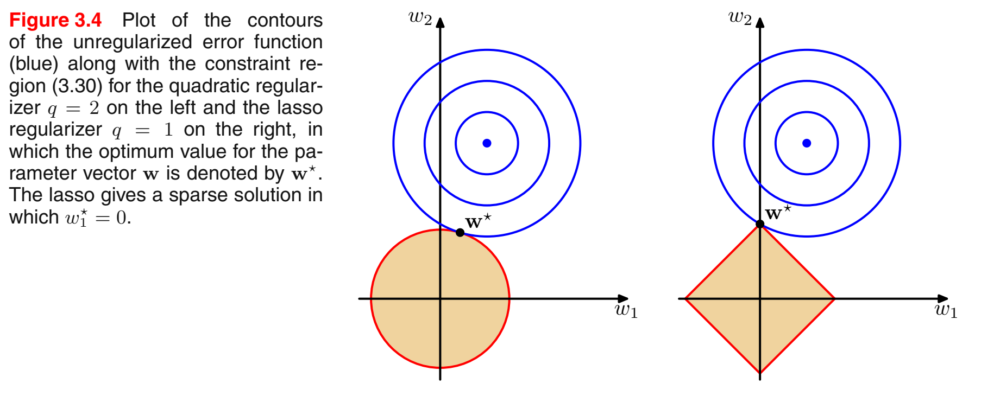

# Linear Models for Regression

[toc]

## 3.1 Linear Basis Function Models

#### Linear Regression

The simplest linear model for regression is one that involves a linear combination of the input variables  
$$
y(\textbf{x},\textbf{w})=w_0+w_1x_1+_\cdots+w_Dx_D\tag{3.1}
$$
where $\textbf{x}=(x_1,_\cdots,x_D)^{\text{T}}$

Extend the class of models by considering linear combinations of fixed nonlinear functions of the input variables, of the form  
$$
y(\textbf{x},\textbf{w})=w_0+\sum_{j=1}^{M-1}w_j\phi_j(\textbf{x})\tag{3.2}
$$
where $\phi_j(\textbf{x})$ are known as *basis functions*.

### 3.1.1 Maximum likelihood and least squares

**We have:**

target $t$, deterministic function $y(\textbf{x},\textbf{w})$ with additive noise so that
$$
t=y(\textbf{x},\textbf{w})+\epsilon\tag{3.7}
$$
where $\epsilon$ is a zero mean Gaussian random variable with precision (inverse variance) $\beta$. Thus
$$
p(t|\textbf{x},\textbf{w},\beta)=\mathcal{N}(t|y(\textbf{x},\textbf{w}),\beta^{-1})\tag{3.8}
$$
In the case of a Gaussian conditional distribution of the form (3.8), the conditional mean will be simply
$$
\mathbb{E}[t|\textbf{x}]=\int tp(t|\textbf{x})\text{d}t=y(\textbf{x},\textbf{w})\tag{3.9}
$$
We group the target variables {$t_n$} into a column vector that we denote by $\textsf{t}$. Making the assumption that these data points are drawn independently from the distribution (3.8), we obtain the following expression for the likelihood function
$$
p(\textsf{t}|\textbf{X},\textbf{w},\beta)=\prod_{n=1}^N\mathcal{N}(t_n|\textbf{w}^{\text{T}}\phi(\textbf{x}_n),\beta^{-1})\tag{3.10}
$$
Taking the logarithm
$$
\begin{align}
	\ln p(\textsf{t}|\textbf{w},\beta)&=\sum_{n=1}^N\ln\mathcal{N}(t_n|\textbf{w}^{\text{T}}\phi(\textbf{x}_n),\beta^{-1})\\
	&=\frac{N}{2}\ln\beta-\frac{N}{2}\ln(2\pi)-\beta E_D(\textbf{w})
\end{align}\tag{3.11}
$$
where the sum-of-squares error function is defined by
$$
E_D(\textbf{w})=\frac{1}{2}\sum_{n=1}^N\{t_n-\textbf{w}^{\text{T}}\phi(\textbf{x}_n)\}^2\tag{3.12}
$$

1. Consider $\textbf{w}$, The gradient of the log likelihood function (3.11) takes the form

$$
\nabla\ln p(\textsf{t}|\textbf{w},\beta)=\sum_{n=1}^N\{t_n-\textbf{w}^{\text{T}}\phi(\textbf{x}_n)\}\phi(\textbf{x}_n)^{\text{T}}\tag{3.13}
$$

Solving for $\textbf{w}$ we obtain  
$$
\textbf{w}_{\text{ML}}=\left(\boldsymbol{\Phi}^{\text{T}}\boldsymbol{\Phi}\right)^{-1}\boldsymbol{\Phi}^{\text{T}}\textsf{t}\tag{3.14}
$$
which are known as the *normal equations* for the least squares problem.

Here $\boldsymbol{\Phi}$ is an $N\times M$ matrix, called the *design matrix*, whose elements are given by $\Phi_{nj}=\phi_j(\textbf{x}_n)$, so that
$$
\boldsymbol{\Phi}=
\begin{pmatrix}
	\phi_0(\textbf{x}_1)&\phi_1(\textbf{x}_1)&\cdots&\phi_{M-1}(\textbf{x}_1)\\
	\phi_0(\textbf{x}_2)&\phi_1(\textbf{x}_2)&\cdots&\phi_{M-1}(\textbf{x}_2)\\
	\vdots&\vdots&\ddots&\vdots\\
	\phi_0(\textbf{x}_N)&\phi_1(\textbf{x}_N)&\cdots&\phi_{M-1}(\textbf{x}_N)
\end{pmatrix}\tag{3.16}
$$
The quality
$$
\boldsymbol{\Phi}^\dagger\equiv\left(\boldsymbol{\Phi}^{\text{T}}\boldsymbol{\Phi}\right)^{-1}\boldsymbol{\Phi}^{\text{T}}\tag{3.17}
$$
is known as the *Moore-Penrose pseudo-inverse* of the matrix $\boldsymbol{\Phi}$. It can be regarded as a generalization of the notion of matrix inverse to nonsquare matrices.   

If we make the bias parameter explicit, then the final result of $w_0$ becomes
$$
w_0=\bar{t}-\sum_{j=1}^{M-1}w_j\overline{\phi_j}\tag{3.19}
$$
where we have defined
$$
\bar{t}=\frac{1}{N}\sum_{n=1}^Nt_n,\ \ \ \ \overline{\phi_j}=\frac{1}{N}\sum_{n=1}^N\phi_j(\textbf{x}_n)\tag{3.20}
$$
Thus the bias $w_0$ compensates for the difference between the averages (over the training set) of the target values and the weighted sum of the averages of the basis function values.  

2. Consider $\beta$, giving

$$
\frac{1}{\beta_{ML}}=\frac{1}{N}\sum_{n=1}^N\{t_n-\textbf{w}_{\text{ML}}^{\text{T}}\phi(\textbf{x}_n)\}^2\tag{3.21}
$$

and so we see that the inverse of the noise precision is given by the residual variance of the target values around the regression function.  

### 3.1.2 Geometry of least squares

### 3.1.3 Sequential learning

We can obtain a sequential learning algorithm by applying the technique of *stochastic gradient descent*, also known as *sequential gradient descent*, as follows.

If the error function comprises a sum over data points $E=\sum_nE_n$, then after presentation of pattern $n$, the stochastic gradient descent algorithm updates the parameter vector $\textbf{w}$ using
$$
\textbf{w}^{(\tau+1)}=\textbf{w}^{(\tau)}-\eta\nabla E_n\tag{3.22}
$$

* $\tau$ is the iteration number
* $\eta$ is the learning rate

For the sum-of-squares error function (3.12), this gives
$$
\textbf{w}^{(\tau+1)}=\textbf{w}^{(\tau)}+\eta(t_n-\textbf{w}^{(\tau)\text{T}}\phi_n)\phi_n\tag{3.23}
$$
where $\phi_n=\phi(\textbf{x}_n)$. This is known as *least-mean-squares* or the *LMS* algorithm.  

### 3.1.4 Regularized least squares

Error function with regularization form
$$
E_D(\textbf{w})+\lambda E_W(\textbf{w})\tag{3.24}
$$
and becomes
$$
\frac{1}{2}\sum_{n=1}^N\{t_n-\textbf{w}^{\text{T}}\phi(\textbf{x}_n)\}^2+\frac{\lambda}{2}\textbf{w}^{\text{T}}\textbf{w}\tag{3.27}
$$
also known as *weight decay* because in sequential learning algorithms, it encourages weight values to decay towards zero, unless supported by the data. In statistics, it provides an example of a *parameter shrinkage* method because it shrinks parameter values towards zero.

Setting the gradient of (3.27) with respect to $\textbf{w}$ to zero, and solving for $\textbf{w}$ as before, we obtain
$$
\textbf{w}=\left(\lambda\textbf{I}+\boldsymbol{\Phi}^{\text{T}}\boldsymbol{\Phi}\right)^{-1}\boldsymbol{\Phi}^{\text{T}}\tag{3.28}
$$
A more generalized form is
$$
\frac{1}{2}\sum_{n=1}^N\{t_n-\textbf{w}^{\text{T}}\phi(\textbf{x}_n)\}^2+\frac{\lambda}{2}\sum_{j=1}^M|w_j|^q\tag{3.29}
$$

#### **Lasso regression**

$q=1$ is known as the *lasso* in the statistic literature.

It has the property that if $λ$ is sufficiently large, some of the coefficients $w_j$ are driven to zero, leading to a *sparse* model in which the corresponding basis functions play no role.   

To see this, we first note that minimizing (3.29) is equivalent to minimizing the unregularized sum-of-squares error (3.12) subject to the constraint  
$$
\sum_{j=1}^M|w_j|^q\le\eta\tag{3.30}
$$
for an appropriate value of the parameter $\eta$.

### 3.1.5 Multiple outputs

**Difference:**

$\textbf{t}$ has $K$-dimension. So we take the form
$$
\textbf{y}(\textbf{x},\textbf{w})=\textbf{W}^{\text{T}}\phi(\textbf{x})\tag{3.31}
$$

* $\textbf{y}$ is a $K$-dimensional vector
* $\textbf{W}$ is an $M\times K$ matrix
* $\phi(\textbf{x})$ is an $M$-dimensional column vector with elements $\phi_j(\textbf{x})$, with $\phi_0(\textbf{x})$ =1

Suppose we take the conditional distribution of the target vector to be an isotropic Gaussian of the form  
$$
p(\textsf{t}|\textbf{x},\textbf{W},\beta)=\mathcal{N}(\textsf{t}|\textbf{W}^{\text{T}}\phi(\textbf{x}),\beta^{-1}\textbf{I})\tag{3.32}
$$
If we have a set of observations $\textbf{t}_1,\dots,\textbf{t}_N$, combine them into a matrix $\textbf{T}$ of size $N\times K$, so that
$$
\textbf{T}=
\begin{pmatrix}
	\textsf{t}_1^\text{T}\\
	\textsf{t}_2^\text{T}\\
	\vdots\\
	\textsf{t}_N^\text{T}\\
\end{pmatrix}
$$
Similarly combine $\textbf{X}$. The log likelihood function is then given by
$$
\begin{align}
	p(\textbf{T}|\textbf{X},\textbf{W},\beta)&=\sum_{n=1}^N\ln \mathcal{N}(\textsf{t}|\textbf{W}^{\text{T}}\phi(\textbf{x}),\beta^{-1}\textbf{I})\\
	&=\frac{NK}{2}\ln\left(\frac{\beta}{2\pi}\right)-\frac{\beta}{2}\sum_{n=1}^N||\textbf{t}_n-\textbf{W}^{\text{T}}\phi(\textbf{x})||^2\tag{3.33}
\end{align}
$$
  Maximum with respect to $\textbf{W}$, giving
$$
\textbf{W}_{\text{ML}}=\left(\boldsymbol{\Phi}^{\text{T}}\boldsymbol{\Phi}\right)^{-1}\boldsymbol{\Phi}^{\text{T}}\textbf{T}\tag{3.34}
$$
If we examine this result for each target variable $t_k$, we have
$$
\textbf{w}_k=\left(\boldsymbol{\Phi}^{\text{T}}\boldsymbol{\Phi}\right)^{-1}\boldsymbol{\Phi}^{\text{T}}\textsf{t}_k=\boldsymbol{\Phi}^\dagger\textsf{t}_k\tag{3.35}
$$
where $\textsf{t}_k$ is an $N$-dimensional column vector with components $t_{nk}$ for $n=1,\dots,N$.

Thus the solution to the regression problem decouples between the different target variables.

***

## 3.2 The Bias-Variance Decomposition

**Problem:**

Although the introduction of regularization terms can control over-fitting for models with many parameters, this raises the question of how to determine a suitable value for the regularization coefficient $\lambda$.

**Our method:**

A frequentist viewpoint of the model complexity issue, known as the *bias-variance* trade-off.

Consider the squared loss function, for which the optimal prediction is given by the conditional expectation, which we denote by
$$
h(\textbf{x})=\mathbb{E}[t|\textbf{x}]=\int tp(t|\textbf{x})\text{d}t\tag{3.36}
$$
We showed in Section 1.5.5 that the expected squared loss can be written in the form
$$
\mathbb{E}[L]=\int \{y(\textbf{x})-h(\textbf{x})\}^2p(\textbf{x})\text{d}\textbf{x}+\int \{h(\textbf{x})-t)\}^2\text{d}\textbf{x}\text{d}t\tag{3.37}
$$

* The second term arises from the intrinsic noise on the data and represents the minimum achievable value of the expected loss.  
* The first term depends on $y(\textbf{x})$, which we should minimize.

Consider the first term of (3.37) with **multiple data sets**, which for a particular data set $\mathcal{D}$ takes the form
$$
\{y(\textbf{x};\mathcal{D})-h(\textbf{x})\}^2\tag{3.38}
$$
Because this quantity will be dependent on the particular data set D, we take its average over the ensemble of data sets. Do some tricks we obtain
$$
\begin{align}
	&\{y(\textbf{x};\mathcal{D})-\mathbb{E}_\mathcal{D}[y(\textbf{x};\mathcal{D})]+\mathbb{E}_\mathcal{D}[y(\textbf{x};\mathcal{D})]-h(\textbf{x})\}^2\\
	=&\{y(\textbf{x};\mathcal{D})-\mathbb{E}_\mathcal{D}[y(\textbf{x};\mathcal{D})]\}^2+\{\mathbb{E}_\mathcal{D}[y(\textbf{x};\mathcal{D})]-h(\textbf{x})\}^2\\
	&+2\{y(\textbf{x};\mathcal{D})-\mathbb{E}_\mathcal{D}[y(\textbf{x};\mathcal{D})]\}\{\mathbb{E}_\mathcal{D}[y(\textbf{x};\mathcal{D})]-h(\textbf{x})\}\tag{3.40}
\end{align}
$$
Take the expectation with respect to $\mathcal{D}$ and note that the final term will vanish, giving
$$
\begin{align}
&\mathbb{E}_\mathcal{D}[\{y(\textbf{x};\mathcal{D})-h(\textbf{x})\}^2]\\
&=\underbrace{\{\mathbb{E}_\mathcal{D}[y(\textbf{x};\mathcal{D})]-h(\textbf{x})\}^2}_{\color{blue}{\text{(bias)}}^2}+\underbrace{\mathbb{E}_\mathcal{D}[\{y(\textbf{x};\mathcal{D})-\mathbb{E}_\mathcal{D}[y(\textbf{x};\mathcal{D})]\}^2]}_{\color{red}{\text{variance}}}\tag{3.40}
\end{align}
$$

* The first term, called the squared *bias*, represents the extent to which the average prediction over all data sets differs from the desired regression function.  
* The second term, called the *variance*, measures the extent to which the solutions for individual data sets vary around their average, and hence this measures the extent to which the function $y(\textbf{x};\mathcal{D})$ is sensitive to the particular choice of data set.  

If we substitute this expansion back into (3.37), we obtain the following decomposition of the expected squared loss
$$
\text{expected loss}=(\text{bias})^2+\text{variance}+\text{noise}\tag{3.41}
$$
where
$$
\begin{align}
	(\text{bias})^2&=\int \{\mathbb{E}_\mathcal{D}[y(\textbf{x};\mathcal{D})]-h(\textbf{x})\}^2p(\textbf{x})\text{d}\textbf{x}\tag{3.42}\\
	\text{variance}&=\int \mathbb{E}_\mathcal{D}[\{y(\textbf{x};\mathcal{D})-\mathbb{E}_\mathcal{D}[y(\textbf{x};\mathcal{D})]\}^2]p(\textbf{x})\text{d}\textbf{x}\tag{3.43}\\
	\text{noise}&=\int\{h(\textbf{x})-t)\}^2p(\textbf{x},t)\text{d}\textbf{x}\text{d}t\tag{3.44}
\end{align}
$$

***

## 3.3 Bayesian Linear Regression

